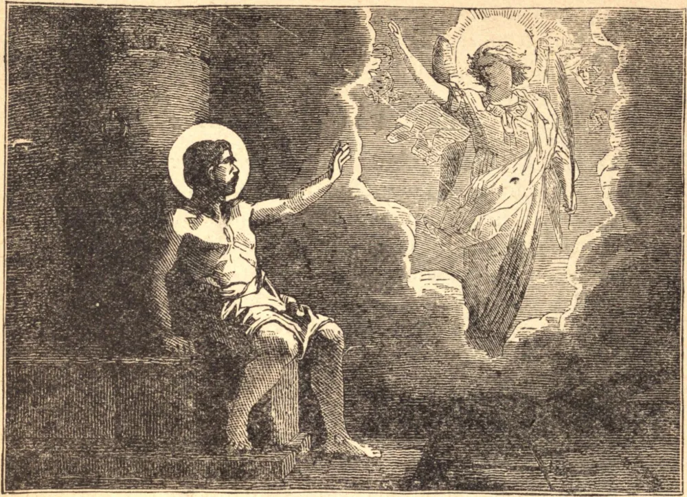

# 9 de novembro — SÃO TEODORO TIRO, Mártir

SÃO TEODORO nasceu de uma nobre família no Oriente, e foi alistado, ainda jovem, no exército imperial. No início de 306, o imperador promulgou um édito exigindo que todos os cristãos oferecessem sacrifício, e Teodoro acabara de juntar-se à legião e marchara com ela para o Ponto, quando teve de escolher entre a apostasia e a morte. Declarou diante de seu comandante que estava pronto a ser cortado em pedaços e oferecer cada membro a seu Criador, que havia morrido por ele. Desejando vencê-lo pela brandura, o comandante deixou-o em paz por algum tempo, para que refletisse sobre sua resolução; mas Teodoro usou sua liberdade para incendiar o grande templo de Ísis, e não fez segredo desse ato. Ainda assim, seu juiz suplicou-lhe que renunciasse à sua fé e salvasse a vida; mas Teodoro fez o sinal da cruz, e respondeu: "Enquanto eu tiver fôlego, confessarei o nome de Cristo." Após cruel tortura, o juiz mandou-o pensar na vergonha a que Cristo o havia reduzido. "Esta vergonha", respondeu Teodoro, "eu e todos os que invocam Seu nome a tomamos com alegria." Foi condenado a ser queimado. Ao subir a chama, um cristão viu sua alma subir como um lampejo de luz para o céu.

## Reflexão

Estamos alistados no mesmo serviço que os santos mártires, e também nós devemos ter coragem e constância se quisermos ser perfeitos soldados de Jesus Cristo. Tomemos parte com eles em confessar a fé de Cristo e desprezar o mundo, para que tenhamos parte com eles no reino de Cristo.
