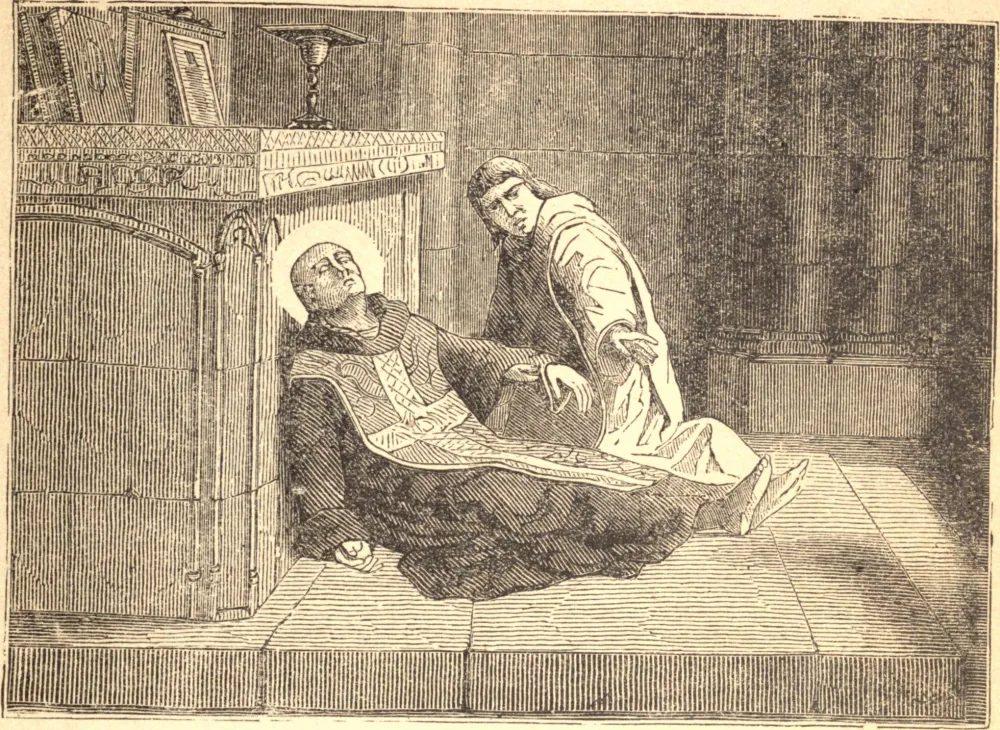

# 10 de novembro — SANTO ANDRÉ AVELINO

APÓS uma santa juventude, Lancelote Avelino foi ordenado sacerdote em Nápoles. Aos trinta e seis anos de idade entrou na Ordem dos Teatinos, e tomou o nome de André, para mostrar seu amor pela cruz. Por cinquenta anos foi afligido por uma hérnia muitíssimo dolorosa; contudo, jamais quis usar uma carruagem. Certa vez, quando levava o Viático, e uma tempestade havia apagado as lâmpadas, uma luz celestial o envolveu, guiou-lhe os passos e o abrigou da chuva. Mas, via de regra, seus sofrimentos não eram aliviados nem por Deus nem pelos homens.

No último dia de sua vida, Santo André levantou-se para celebrar a Missa. Estava em seu octogésimo nono ano, e tão débil que mal podia chegar ao altar. Começou o "*Judica*", e caiu para a frente num acesso de apoplexia. Deitado sobre um colchão de palha, todo o seu corpo se convulsionava em agonia, enquanto o demônio, em forma visível, avançava para apoderar-se de sua alma. Então, enquanto seus irmãos oravam e choravam, ouviu-se a voz de Maria, ordenando ao anjo da guarda do Santo que reenviasse o tentador ao inferno. Um sorriso calmo e santo pousou nas feições do Santo moribundo, ao passo que, com uma saudação cheia de gratidão à imagem de Maria, exalou sua alma a Deus. Sua morte sucedeu no dia 10 de novembro de 1608.

**Reflexão**—Santo André, que padeceu agonia tão terrível, é o padroeiro especial contra a morte súbita. Pedi-lhe que esteja convosco em vossa última hora, e que traga Jesus e Maria em vosso auxílio.
