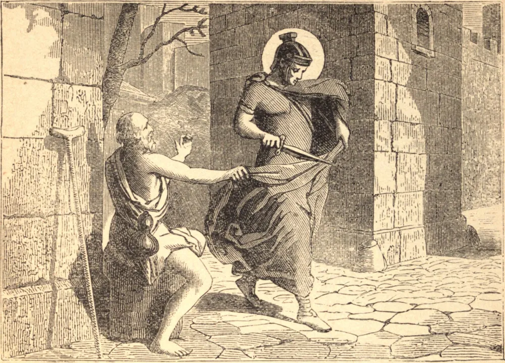

# 11 de novembro — SÃO MARTINHO DE TOURS

QUANDO ainda menino, Martinho tornou-se catecúmeno cristão contra a vontade de seus pais; e por isso, aos quinze anos, foi apreendido por seu pai, um soldado pagão, e alistado no exército. Num dia de inverno, quando estava aquartelado em Amiens, encontrou um mendigo quase nu e enregelado de frio. Não tendo dinheiro, cortou seu manto em dois e deu-lhe a metade. Naquela noite viu Nosso Senhor revestido da metade do manto, e ouviu-O dizer aos anjos: "Martinho, ainda catecúmeno, envolveu-Me nesta veste." Isto o decidiu a ser batizado, e pouco depois deixou o exército.

Conseguiu converter sua mãe; mas, sendo expulso de seu lar pelos arianos, abrigou-se com Santo Hilário, e fundou perto de Poitiers o primeiro mosteiro da França. Em 372 foi feito Bispo de Tours. Seu rebanho, embora cristão de nome, era ainda pagão de coração. Desarmado e acompanhado apenas por seus monges, Martinho destruiu os templos e bosques pagãos, e completou por sua pregação e milagres a conversão do povo, donde é conhecido como o Apóstolo da Gália. Seus últimos onze anos foram passados em humilde labor para expiar suas faltas, enquanto Deus manifestava por milagres a pureza de sua alma.

**Reflexão**—Foi por Cristo crucificado que São Martinho trabalhou. Trabalhas tu pelo mesmo Senhor?
