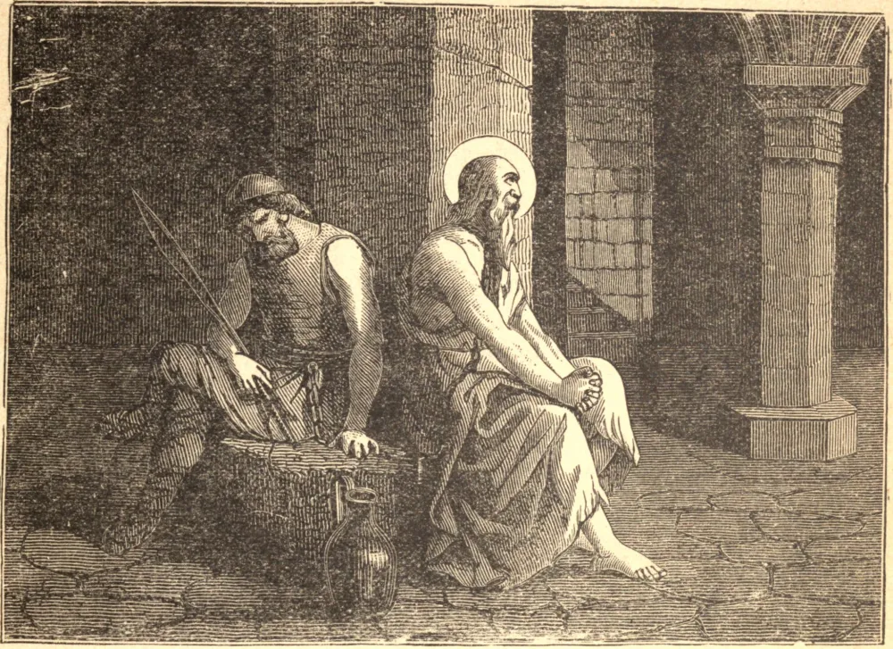

# 12 de novembro — SÃO MARTINHO, Papa

SÃO MARTINHO, que ocupou a Sé Romana de 649 a 655 d.C., incorreu na inimizade da corte bizantina por sua enérgica oposição à heresia monotelita, e o Exarca Olímpio chegou ao ponto de tentar mandar assassinar o Papa enquanto este estava de pé ao altar na Igreja de Santa Maria Maior; mas o pretenso assassino foi miraculosamente ferido de cegueira, e seu senhor recusou-se a tomar qualquer outra parte no assunto. Seu sucessor não teve tais escrúpulos: apoderou-se de Martinho, e levou-o a bordo de um navio com destino a Constantinopla. Após uma viagem de três meses, chegou-se à ilha de Naxos, onde o Papa foi mantido em confinamento por um ano, e finalmente, em 654, conduzido em cadeias à cidade imperial. Foi então banido para o Quersoneso Táurico, onde definhou por quatro meses, em doença e fome, até que Deus o libertou pela morte no dia 12 de novembro de 655.

## Reflexão

Houve tempos na história do cristianismo em que suas verdades pareceram à beira da extinção. Mas há uma Igreja cujo testemunho jamais falhou: é a Igreja de São Pedro, a Sé Apostólica e Romana. Depositai toda a vossa confiança em seu ensino!
