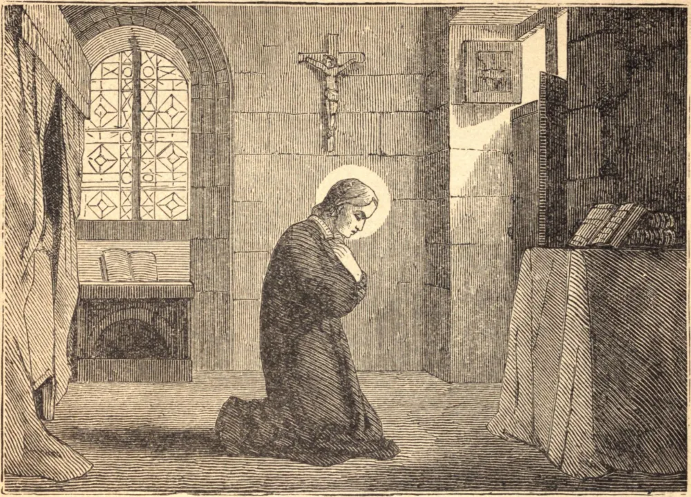

# 13 de novembro — SÃO ESTANISLAU KOSTKA

SÃO ESTANISLAU era de uma nobre família polonesa. Aos catorze anos de idade foi com seu irmão mais velho Paulo ao Colégio dos Jesuítas em Viena; e embora Estanislau fosse sempre alegre e de doce temperamento, suas austeridades eram sentidas como uma censura por Paulo, que o maltratava vergonhosamente.

Esse mau trato e suas próprias penitências acarretaram-lhe uma perigosa enfermidade e, estando numa casa luterana, não pôde mandar chamar um sacerdote. Lembrou-se então de haver lido sobre sua padroeira, Santa Bárbara, que ela jamais permitia que seus devotos morressem sem o Santo Viático: apelou devotamente ao seu auxílio, e ela apareceu com dois anjos, que lhe deram a Sagrada Hóstia. Foi curado dessa enfermidade pela própria Nossa Senhora, e por ela foi mandado entrar na Companhia de Jesus.

Para evitar a oposição de seu pai, foi obrigado a fugir de Viena; e, tendo provado sua constância ao desempenhar alegremente os mais humildes ofícios, foi admitido ao noviciado em Roma. Ali viveu por dez breves meses, marcados por rara piedade, obediência e devoção ao seu instituto. Morreu, como havia orado para morrer, na festa da Assunção de 1568, aos dezessete anos de idade.

**Reflexão**—São Estanislau ensina-nos, em toda provação da vida, e acima de tudo na hora da morte, a recorrer ao nosso Santo padroeiro, e a confiar sem temor em seu auxílio.
