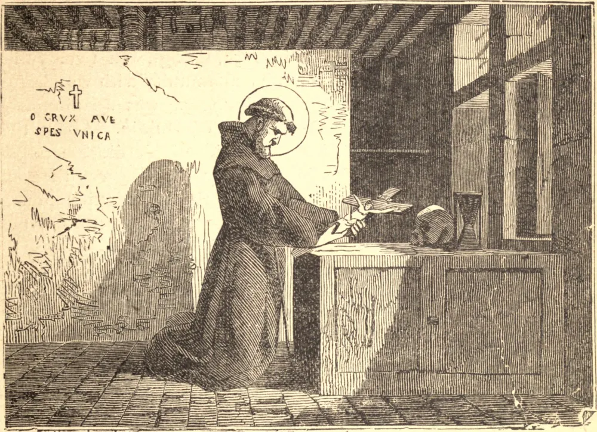

# 14 de novembro — SÃO DIDACO

SÃO DIDACO nasceu na Espanha, em meados do século quinze. Foi notável desde a infância por seu amor à solidão e, quando jovem, retirou-se e levou uma vida de eremita, ocupando-se em tecer esteiras, como os padres do deserto. Visando perfeição ainda mais elevada, entrou na Ordem de São Francisco. Sua falta de instrução e sua humildade não lhe permitiam aspirar ao sacerdócio, e permaneceu irmão leigo até sua morte, perfeito em sua estrita observância dos votos de pobreza, castidade e obediência, e mortificando sua vontade e seus sentidos de todo modo que podia engendrar.

Certa vez foi enviado por seus superiores às Ilhas Canárias, aonde foi com alegria, esperando conquistar a coroa do martírio. Tal, porém, não era a vontade de Deus, e depois de fazer muitas conversões por seu exemplo e suas santas palavras, foi chamado de volta à Espanha.

Ali, após uma longa e dolorosa enfermidade, terminou seus dias, abraçando a cruz, que tão ternamente amara por toda a sua vida. Morreu com as palavras do hino "*Dulce lignum*" nos lábios.

**Reflexão**—Se Deus estiver em teu coração, estará também em teus lábios; pois Cristo disse: "Da abundância do coração fala a boca."
