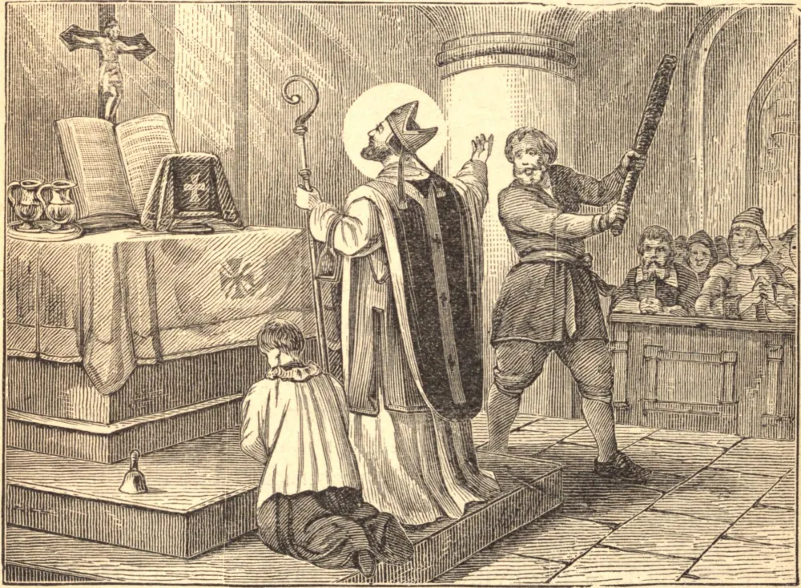

# 14 de novembro — SÃO LOURENÇO O'TOOLE, Arcebispo de Dublin

SÃO LOURENÇO, ao que parece, nasceu por volta do ano de 1125. Quando tinha apenas dez anos, seu pai o entregou como refém a Dermod Mac Murchad, Rei de Leinster, que tratou a criança com grande desumanidade, até que seu pai obrigou o tirano a colocá-lo nas mãos do Bispo de Glendalough, no condado de Wicklow. O santo jovem, por sua fidelidade em corresponder à graça divina, tornou-se um modelo de virtudes. Com a morte do bispo, que era também abade do mosteiro, São Lourenço foi escolhido abade em 1150, embora tivesse apenas vinte e cinco anos, e governou sua numerosa comunidade com maravilhosa virtude e prudência. Em 1161, São Lourenço foi escolhido por unanimidade para ocupar a nova sé metropolitana de Dublin. Por volta do ano de 1171, viu-se obrigado, por causa dos assuntos de sua diocese, a passar à Inglaterra para ver o rei, Henrique II, que então se encontrava em Cantuária. O Santo foi recebido pelos monges beneditinos de Christ Church com a maior honra e respeito. No dia seguinte, quando o santo arcebispo avançava para o altar a fim de oficiar, um maníaco, que tinha ouvido muito de sua santidade, e que era movido pela ideia de fazer de tão santo homem um outro São Tomás, desferiu-lhe um violento golpe na cabeça. Todos os presentes concluíram que estava mortalmente ferido; mas o Santo, voltando a si, pediu um pouco de água, abençoou-a, e tendo sua ferida lavada com ela, o sangue cessou imediatamente, e o arcebispo celebrou a Missa. Em 1175, Henrique II da Inglaterra ofendeu-se com Roderic, o monarca da Irlanda, e São Lourenço empreendeu outra viagem à Inglaterra para negociar uma reconciliação entre eles. Henrique ficou tão comovido por sua piedade, caridade e prudência que lhe concedeu tudo quanto pediu, e deixou toda a negociação a seu critério. Nosso Santo terminou sua jornada aqui na terra no dia 14 de novembro de 1180, e foi sepultado na igreja da abadia em Eu, nos confins da Normandia.
