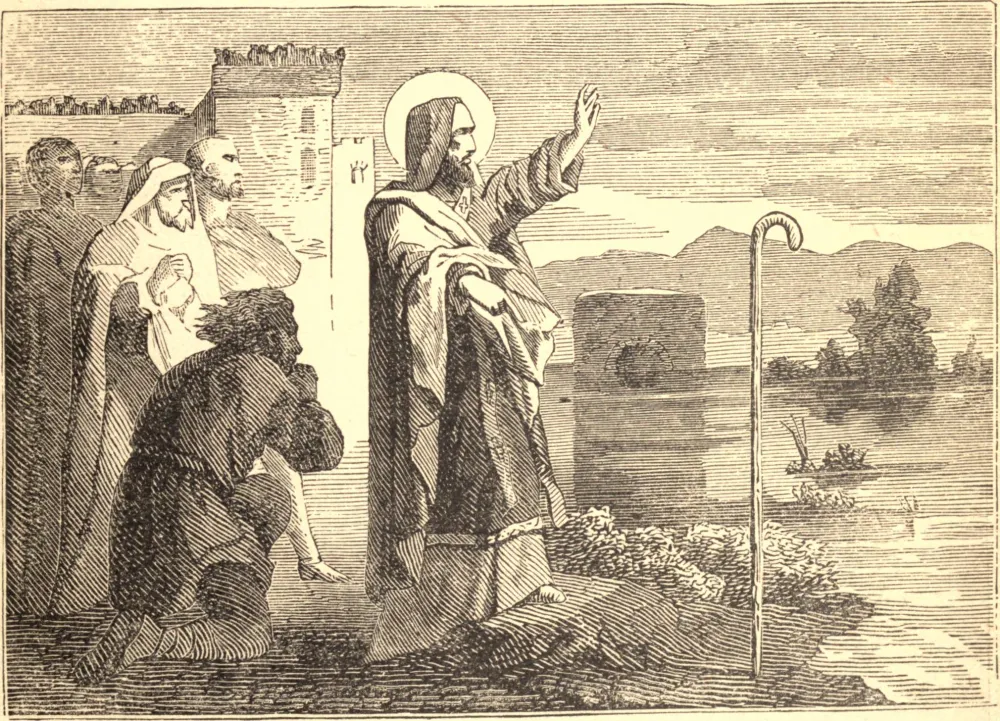

# 17 de novembro — SÃO GREGÓRIO TAUMATURGO

SÃO GREGÓRIO nasceu no Ponto, de pais pagãos. Na Palestina, por volta do ano 231, estudou filosofia sob o grande Orígenes, que o conduziu da busca da sabedoria humana a Cristo, que é a Sabedoria de Deus. Não muito depois, foi feito Bispo de Neocesareia, em seu próprio país.

Estando ele certa noite acordado, um ancião entrou em seu quarto, e apontou para uma senhora de beleza sobre-humana, e radiante de luz celestial. Esse ancião era São João Evangelista, e a senhora ordenou-lhe que desse a Gregório a instrução que ele desejava. Em seguida, deu a São Gregório um credo que continha em toda a sua plenitude a doutrina da Trindade. São Gregório pô-lo por escrito, dirigiu por ele toda a sua pregação, e transmitiu-o a seus sucessores.

Forte nesta fé, subjugou os demônios; predisse o futuro. À sua palavra, uma rocha moveu-se de seu lugar, um rio mudou seu curso, um lago secou. Converteu sua diocese, e fortaleceu os que estavam sob perseguição. Esmagou uma heresia que se erguia; e, depois que partiu, este credo preservou seu rebanho da peste ariana. São Gregório morreu no ano de 270.

**Reflexão**—A devoção à bendita Mãe de Deus é a segura proteção da fé em seu Filho Divino. Cada vez que a invocamos, renovamos nossa fé no Deus Encarnado; revertemos o pecado e a incredulidade de nossos primeiros pais; tomamos parte com aquela que foi bem-aventurada porque creu.
