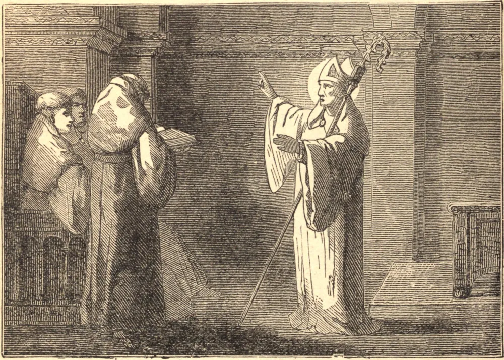

# 18 de novembro — SANTO ODÃO DE CLUNY

NA véspera de Natal de 877, um nobre da Aquitânia implorou a Nossa Senhora que lhe concedesse um filho. Sua oração foi atendida; Odão nasceu, e seu pai agradecido ofereceu-o a São Martinho.

Odão cresceu em sabedoria e em virtude, e seu pai ansiava por vê-lo brilhar na corte. Mas a atração da graça era forte demais. O coração de Odão estava triste e sua saúde declinava, até que abandonou o mundo e buscou refúgio sob a sombra de São Martinho em Tours. Mais tarde tomou o hábito de São Bento em Baume, e foi compelido a tornar-se abade da grande abadia de Cluny, que então se construía. Governou-a com a mão de um mestre e a doçura de um Santo.

O Papa mandava chamá-lo amiúde para agir como pacificador entre príncipes em contenda, e foi numa dessas missões de misericórdia que adoeceu em Roma. A seu insistente rogo, foi levado de volta a Tours, onde morreu aos pés do "seu próprio São Martinho", em 942.

**Reflexão**—"Basta apenas", diz o Padre Newman, "que um católico mostre devoção a algum Santo, para receber benefícios especiais de sua intercessão."
