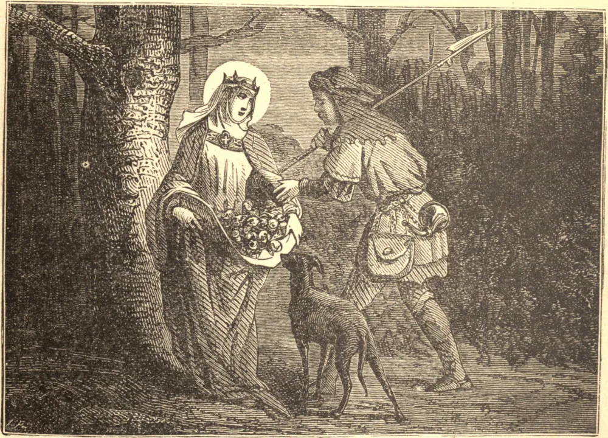

# 19 de novembro — SANTA ISABEL DA HUNGRIA

ISABEL era filha de um rei da Hungria, e sobrinha de Santa Edviges. Foi prometida em casamento, ainda na infância, a Luís, Langrave da Turíngia, e criada na corte do pai dele. Não contente em receber diariamente grande número de pobres em seu palácio, e socorrer todos os aflitos, edificou vários hospitais, onde servia os enfermos, curando com as próprias mãos as chagas mais repugnantes. Certa vez, quando levava nas dobras de seu manto algumas provisões para os pobres, encontrou seu marido que regressava da caça. Espantado ao vê-la curvada sob o peso de seu fardo, ele abriu o manto que ela mantinha apertado contra si, e nele não achou senão belas rosas vermelhas e brancas, embora não fosse a estação das flores. Mandando-a seguir seu caminho, ele tomou uma das maravilhosas rosas, e guardou-a por toda a sua vida. À morte do marido, foi cruelmente expulsa de seu palácio, e forçada a vagar pelas ruas com seus filhinhos, presa da fome e do frio; mas ela acolhia todos os seus sofrimentos, e continuou a ser a mãe dos pobres, convertendo muitos por sua vida santa. Morreu em 1231, com a idade de vinte e quatro anos.

## Reflexão

Esta jovem e delicada princesa fez-se serva e enfermeira dos pobres. Que seu exemplo nos ensine a desprezar as opiniões do mundo e a vencer nossas repugnâncias naturais, a fim de servir a Cristo nas pessoas de seus pobres.
