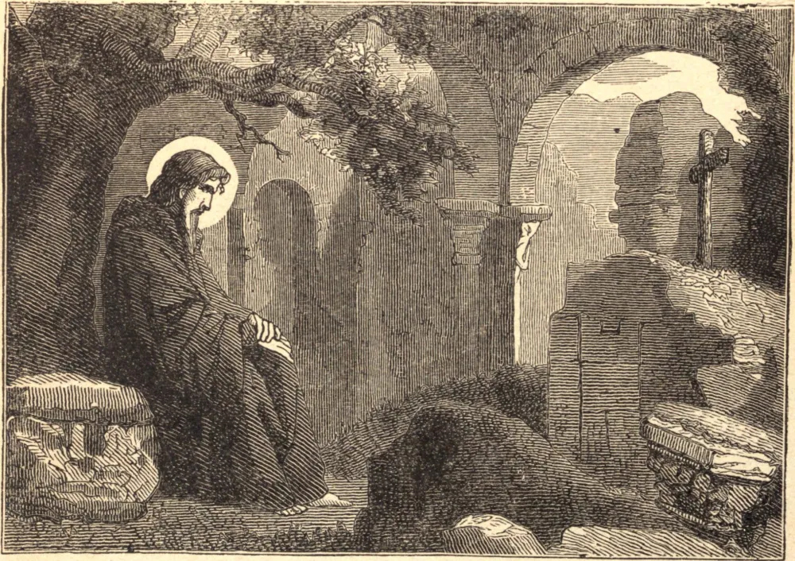

# 20 de novembro — SÃO FÉLIX DE VALOIS

SÃO FÉLIX era filho do Conde de Valois. Sua mãe, ao longo de toda a sua juventude, fez tudo o que pôde para cultivar nele um espírito de caridade. O divórcio injusto entre seus pais amadureceu uma resolução há muito formada de deixar o mundo; e, confiando sua mãe ao piedoso irmão dela, Thibault, Conde de Champanha, ele tomou o hábito cisterciense em Claraval.

Suas raras virtudes atraíram sobre ele tamanha admiração que, com o consentimento de São Bernardo, fugiu para a Itália, onde levou uma vida austera com um eremita ancião. Por esse tempo foi ordenado sacerdote, e, tendo morrido seu velho conselheiro, regressou à França, e por muitos anos viveu como solitário em Cerfroid.

Ali Deus inspirou-lhe o desejo de fundar uma Ordem para a redenção dos cativos cristãos, e moveu São João de Mata, então um jovem, a conceber semelhante desejo. Juntos redigiram as regras da Ordem da Santíssima Trindade. Muitos discípulos reuniram-se em torno deles; e, vendo que chegara o tempo de mais ação, os dois Santos fizeram uma peregrinação a Roma para obter a confirmação da Ordem de Inocêncio III. Sua oração foi atendida, e os últimos quinze anos da longa vida de Félix foram passados organizando e desenvolvendo suas fundações em rápido crescimento. Morreu em 1213.

**Reflexão**—"Pensa quanto", diz São João Crisóstomo, "e quão amiúde tua boca pecou, e te dedicarás inteiramente à conversão dos pecadores. Pois por este único meio apagarás todos os teus pecados, porquanto tua boca se tornará a boca de Deus."
