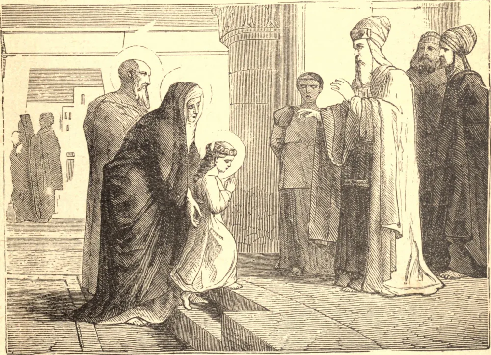

# 21 de novembro — A APRESENTAÇÃO DA SANTÍSSIMA VIRGEM MARIA

PAIS religiosos nunca deixam, por devota oração, de consagrar seus filhos ao serviço e amor divinos, tanto antes como depois de seu nascimento. Alguns dentre os judeus, não contentes com esta consagração geral de seus filhos, ofereciam-nos a Deus em sua infância, pelas mãos dos sacerdotes no Templo, para serem alojados em aposentos pertencentes ao Templo, e criados a serviço dos sacerdotes e levitas no sagrado ministério.

É uma antiga tradição que a Santíssima Virgem Maria foi assim solenemente oferecida a Deus no Templo em sua infância. Esta festa da Apresentação da Santíssima Virgem a Igreja celebra neste dia.

A terna alma de Maria estava então adornada com as mais preciosas graças, objeto de assombro e louvor para os anjos, e da mais alta complacência para a adorável Trindade; o Pai contemplando-a como sua filha amada, o Filho como uma eleita e preparada para tornar-se sua mãe, e o Espírito Santo como sua dileta esposa. Maria foi a primeira que ergueu o estandarte da virgindade; e, consagrando-a por um voto perpétuo a Nosso Senhor, abriu o caminho a todas as virgens que desde então seguiram seu exemplo.

**Reflexão**—A primeira apresentação de Maria a Deus foi uma oferta sumamente aceitável a seus olhos. Que nossa consagração de nós mesmos a Deus seja feita sob seu patrocínio, e assistida por sua poderosa intercessão e pela união de seus méritos.
