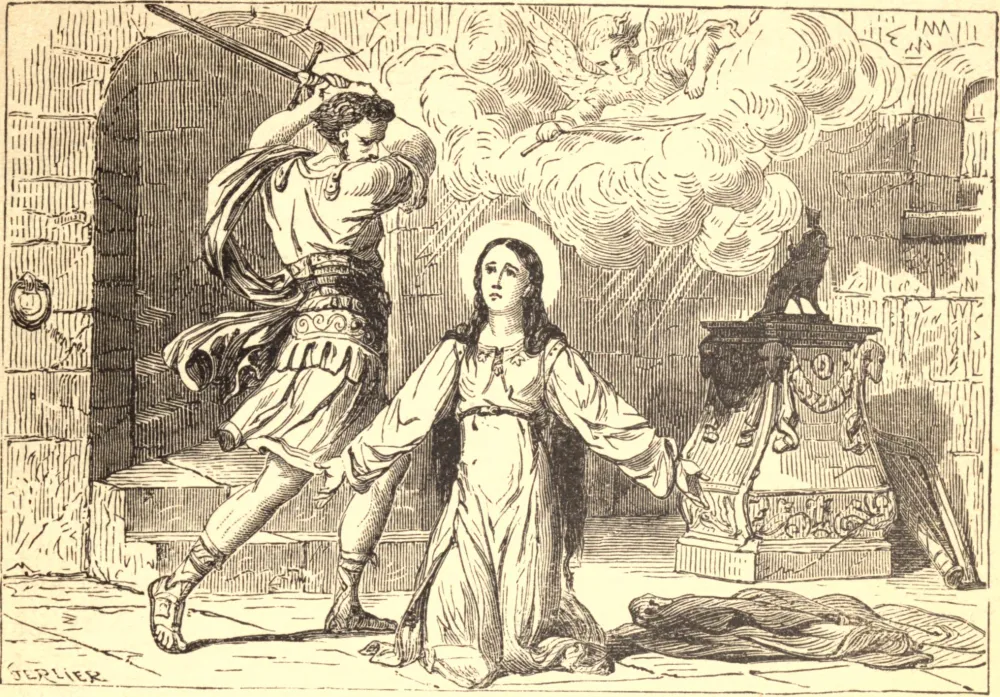

# 22 de novembro — SANTA CECÍLIA, Virgem, Mártir

NA tarde de seu dia de núpcias, com a música do hino nupcial ressoando em seus ouvidos, Cecília, uma rica, bela e nobre donzela romana, renovou o voto pelo qual havia consagrado sua virgindade a Deus. "Puro seja o meu coração e imaculada a minha carne; pois tenho um esposo que não conheceis — um anjo de meu Senhor." O coração de seu jovem marido Valeriano foi comovido por suas palavras; ele recebeu o Batismo, e dentro de poucos dias ele e seu irmão Tibúrcio, que por ele fora conduzido ao conhecimento da Fé, selaram sua confissão com o próprio sangue.

Restava apenas Cecília. "Não sabeis", foi sua resposta às ameaças do prefeito, "que sou a esposa de meu Senhor Jesus Cristo?" A morte que lhe fora destinada era a sufocação, e ela permaneceu um dia e uma noite num banho de ar quente, aquecido sete vezes além do costume. Mas "as chamas não tiveram poder sobre seu corpo, nem um cabelo de sua cabeça foi chamuscado."

O lictor enviado para executá-la desferiu, com mão trêmula, os três golpes que a lei permitia, e deixou-a ainda viva. Por dois dias e duas noites Cecília jazeu, com a cabeça meio decepada, sobre o pavimento de seu banho, plenamente consciente, e aguardando com alegria sua coroa; no terceiro a agonia terminou, e em 177 a virgem Santa devolveu seu espírito puro a Cristo.

**Reflexão**—Santa Cecília nos ensina a regozijar-nos em cada sacrifício como penhor de nosso amor a Cristo, e a acolher os sofrimentos e a morte como apressando nossa união com Ele.
