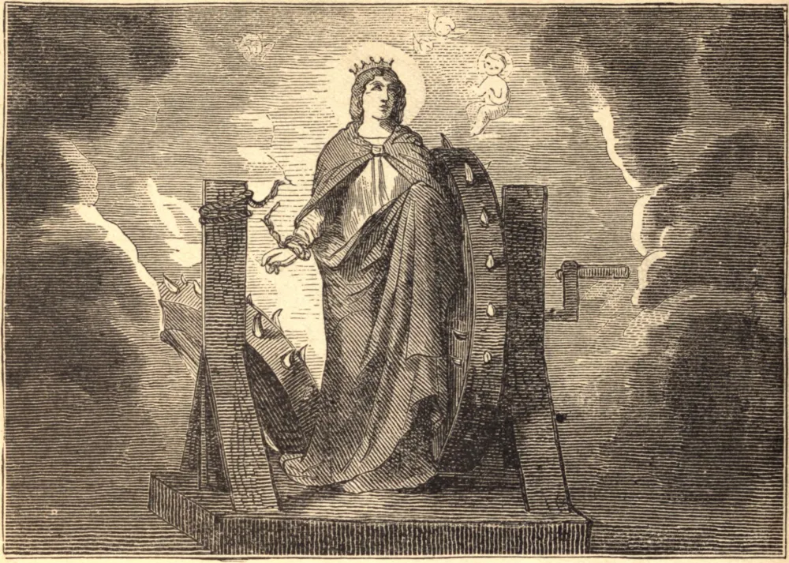

# 25 de novembro — SANTA CATARINA DE ALEXANDRIA

CATARINA era uma nobre virgem de Alexandria. Antes de seu Batismo, diz-se, viu em visão a Santíssima Virgem pedir a seu Filho que a recebesse entre seus servos, mas o divino Infante voltou-se para o outro lado. Após o Batismo, Catarina viu a mesma visão, quando Jesus Cristo a recebeu com grande afeição, e a desposou ante a corte do céu. Quando o ímpio tirano Maximino II veio a Alexandria, fascinado pela sabedoria, beleza e riqueza da Santa, em vão a importunou com seu pedido. Por fim, em sua ira e despeito, ordenou que ela fosse despida e flagelada. Ela fugiu para as montanhas da Arábia, onde os soldados a alcançaram, e, após muitos tormentos, deram-lhe a morte. Seu corpo foi depositado no Monte Sinai, e uma bela lenda relata que, tendo Catarina orado para que homem algum visse ou tocasse seu corpo depois da morte, anjos o levaram à sepultura.

## Reflexão

A constância demonstrada pelos Santos em seu glorioso martírio não pode ser isolada de suas vidas anteriores, mas é sua consequência natural. Se desejamos emular sua perseverança, imitemos primeiro sua fidelidade à graça.
