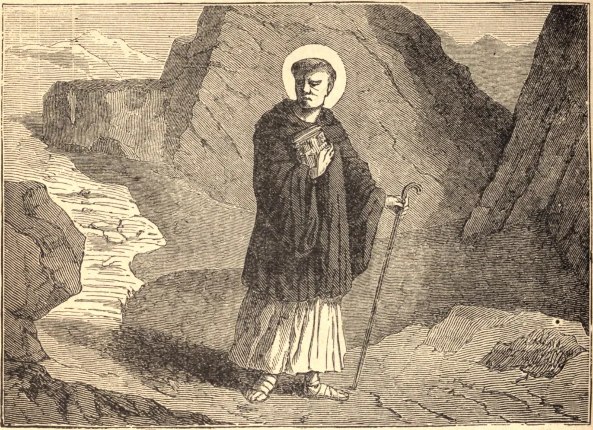

# 27 de novembro — SÃO MÁXIMO, Bispo

SÃO MÁXIMO, abade de Lerins, sucessor de São Honorato, foi notável não apenas pelo espírito de recolhimento, fervor e piedade que lhe eram familiares desde a mais tenra infância, mas ainda mais pela brandura e bondade com que governava o mosteiro, que naquele tempo continha muitos religiosos e era famoso pelo saber e pela piedade de seus irmãos. Exibindo em sua própria pessoa um exemplo das mais sólidas virtudes, suas exortações não podiam deixar de mostrar-se totalmente persuasivas: amando todos os seus religiosos, a quem era sua delícia considerar como uma só família, estabeleceu entre eles aquela doce concórdia, união e santa emulação para o bem-fazer que tornam desnecessário o exercício da autoridade e fazem da submissão um prazer.

O clero e o povo de Fréjus, movidos por tão luminoso exemplo, elegeram Máximo para seu bispo, mas ele tomou a fuga; subsequentemente, porém, foi compelido a aceitar a sé de Riez, onde praticou a virtude em toda mansidão, e morreu em 460, lamentado como o melhor dos pais.

**Reflexão**—"Senhores, fazei a vossos servos o que é justo e equitativo, sabendo que também vós tendes um Senhor no céu."
