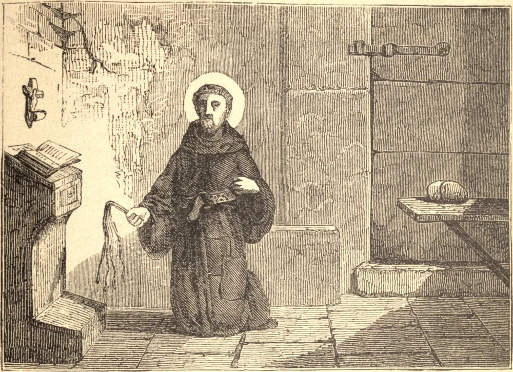

# 28 de novembro — SÃO TIAGO DE LA MARCA DE ANCONA

A pequena cidade de Montbrandon, na Marca de Ancona, deu à luz este Santo. Quando jovem, foi enviado à Universidade de Perúgia, onde seu progresso nos estudos logo o qualificou a ser escolhido preceptor de um jovem fidalgo de Florença. Temendo que pudesse ser tragado no turbilhão dos excessos do mundo, São Tiago aplicou-se à oração e ao recolhimento.

Viajando perto de Assis, entrou na grande Igreja da Porciúncula para orar, e, animado pelo fervor dos santos homens que ali serviam a Deus, e pelo exemplo de seu bem-aventurado fundador São Francisco, determinou pedir naquele mesmo lugar o hábito da Ordem. Começou sua guerra espiritual contra o demônio, o mundo e a carne, com oração assídua e extraordinários jejuns e vigílias. Por quarenta anos nunca passou um dia sem tomar a disciplina.

Sendo escolhido Arcebispo de Milão, fugiu, e não se pôde convencê-lo a aceitar o ofício. Operou vários milagres em Veneza e em outros lugares, e curou de enfermidades perigosas o Duque da Calábria e o Rei de Nápoles. O Santo morreu no convento da Santíssima Trindade de sua Ordem, perto de Nápoles, no dia 28 de novembro, no ano de 1476, tendo noventa anos de idade, setenta dos quais passara em estado religioso.
