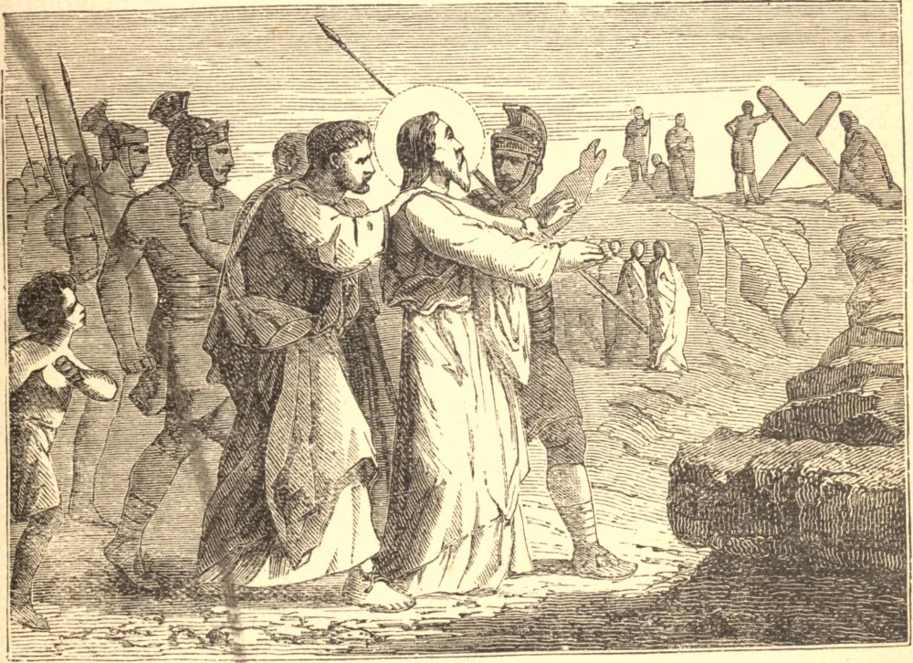

# 30 de novembro — SANTO ANDRÉ, Apóstolo

SANTO ANDRÉ era um dos pescadores de Betsaida, e irmão, talvez irmão mais velho, de São Pedro, e tornou-se discípulo de São João Batista. Parecia sempre ansioso por trazer outros à atenção; quando ele próprio foi chamado por Cristo às margens do Jordão, seu primeiro pensamento foi ir em busca de seu irmão, e disse: "Achamos o Messias", e o trouxe a Jesus. Foi ele novamente quem, quando Cristo quis alimentar os cinco mil no deserto, apontou o pequeno menino com os cinco pães e os peixes.

Santo André partiu em sua missão de plantar a Fé na Cítia e na Grécia, e ao fim de anos de labuta ganhar a coroa do martírio. Após sofrer uma cruel flagelação em Patras, na Acaia, foi deixado, atado por cordas, para morrer numa cruz.

Quando Santo André avistou pela primeira vez o patíbulo em que haveria de morrer, saudou o precioso madeiro com alegria. "Ó boa cruz!", exclamou, "feita formosa pelos membros de Cristo, tão longamente desejada, agora tão felizmente encontrada! Recebe-me em teus braços e apresenta-me a meu Mestre, para que Aquele que me redimiu por meio de ti me aceite agora de ti." Por dois dias inteiros o mártir permaneceu pendurado nesta cruz com vida, pregando, de braços estendidos desde esta cátedra da verdade, a todos os que se aproximavam, e suplicando-lhes que não impedissem sua paixão.

**Reflexão**—Se quisermos fazer o bem aos outros, devemos, como Santo André, manter-nos perto da cruz.
