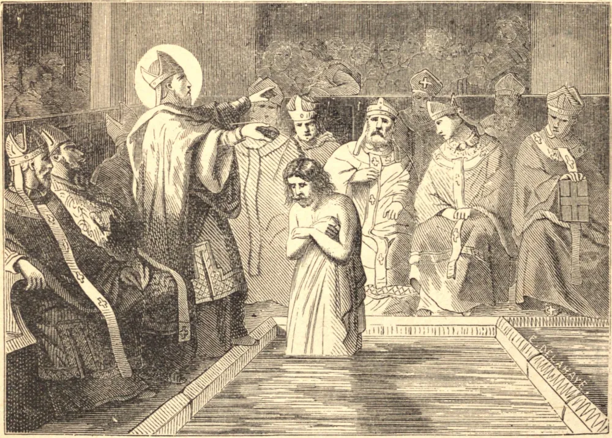

# 1 de outubro — SÃO REMÍGIO, Bispo

REMÍGIO, ou Remi, nasceu de pais nobres e piedosos. Aos vinte e dois anos de idade, a despeito dos cânones e de sua própria relutância, foi aclamado Arcebispo de Reims. Era extraordinariamente alto, seu rosto impresso de uma mescla de majestade e serenidade, seu porte gentil, humilde e recolhido. Era douto e eloquente, e tinha o dom dos milagres. Sua compaixão e caridade eram ilimitadas, e no labor não conhecia cansaço. Seu corpo era a expressão exterior de uma alma nobre e santa, que respirava o espírito da mansidão e da compunção.

Para tão seleto operário Deus tinha trabalho apropriado. O Sul da França estava nas mãos dos arianos, e os pagãos francos arrancavam o Norte dos romanos. São Remígio enfrentou Clóvis, o rei deles, e converteu-o e batizou-o no Natal, em 496. Com ele ganhou toda a nação franca. Derrubou os altares dos ídolos, edificou igrejas e nomeou bispos. Resistiu aos arianos e os silenciou, e converteu tantos que deixou a França um reino católico, sendo o seu rei o mais antigo e, na época, o único filho coroado da Igreja. Morreu em 533, após um episcopado de setenta e quatro anos, o mais longo de que há registro.

**Reflexão**—Poucos homens tiveram tais vantagens naturais e tais dons de graça como São Remi, e poucos realizaram obra tão grande. Aprende com ele a suportar tanto o louvor do mundo quanto o seu escárnio com um coração humilde e mortificado.
