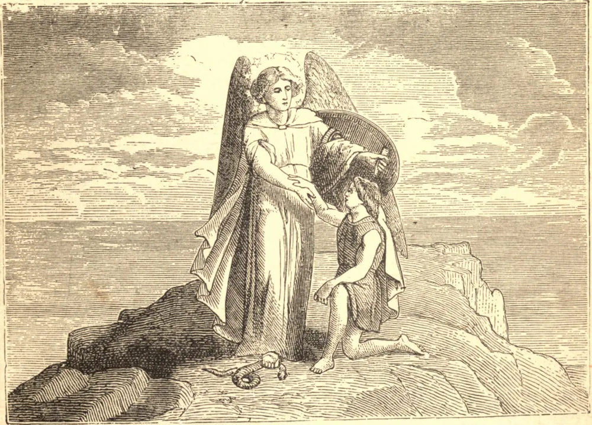

# 2 de outubro — OS SANTOS ANJOS DA GUARDA

DEUS não abandona ao mero acaso nenhuma de Suas obras; por Sua providência está em toda parte presente; nem um cabelo cai da cabeça nem um pardal ao chão sem o Seu conhecimento. Não contente, porém, em conceder tão familiar auxílio em todas as coisas, não contente em outorgar aquela existência que Ele comunica e perpetua através de todo ser vivente, encarregou Seus anjos do ministério de velar e salvaguardar cada uma de Suas criaturas que não contemplam Sua face.

Os reinos têm seus anjos a eles designados, e os homens têm seus anjos; são estes últimos que a religião designa como os Santos Anjos da Guarda. Nosso Senhor diz no Evangelho: "Guardai-vos de escandalizar a qualquer destes pequeninos, pois seus anjos no céu veem a face de Meu Pai." A existência dos Anjos da Guarda é, portanto, um dogma da fé cristã: sendo assim, qual não deveria ser o nosso respeito por aquela segura e santa inteligência que está sempre presente ao nosso lado; e quão grande deveria ser a nossa solicitude, para que, por algum ato nosso, não ofendamos aqueles olhos que estão sempre voltados para nós em todos os nossos caminhos!

**Reflexão**—Ah! não demos ocasião, na linguagem da Sagrada Escritura, a que os anjos da paz chorem amargamente.
