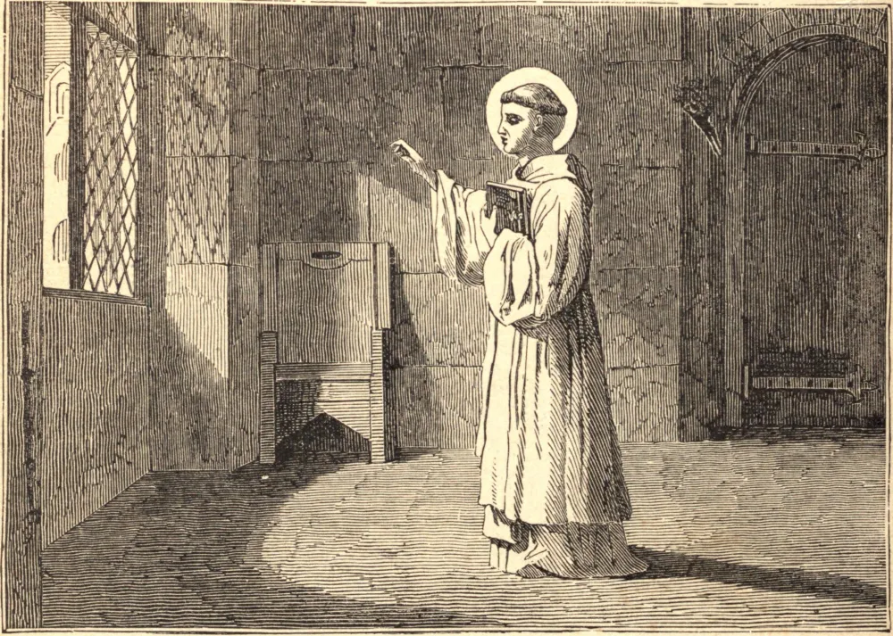

# 3 de outubro — SÃO GERARDO, Abade

SÃO GERARDO era de uma nobre família do condado de Namur, na França. Uma cativante doçura de temperamento, e uma forte inclinação à piedade e à devoção, granjearam-lhe desde o berço a estima e o afeto de todos. Tendo sido enviado em importante missão à Corte da França, ficou grandemente edificado com o fervor dos monges de São Dinis, em Paris, e ardentemente desejou consagrar-se a Deus com eles. Voltando para casa, ajustou seus assuntos temporais e regressou com grande alegria a São Dinis. Vivera dez anos com grande fervor neste mosteiro, quando, em 931, foi enviado por seu abade a fundar uma abadia em sua propriedade em Brogue, a três léguas de Namur. Estabeleceu esta nova abadia e em seguida construiu para si uma pequena cela junto à igreja, e nela viveu como recluso até que Deus o chamou a empreender a reforma de muitos mosteiros, o que fez com êxito. Quando havia passado quase vinte anos nestes zelosos labores, encerrou-se em sua cela, para preparar a alma a fim de receber a recompensa de seus labores, à qual foi chamado no dia 3 de outubro de 959.

## Reflexão

Embora estejamos no mundo, esforcemo-nos por separar-nos dele e consagrar-nos a Deus, lembrando que "o mundo passa, mas aquele que faz a vontade de Deus permanece para sempre."
