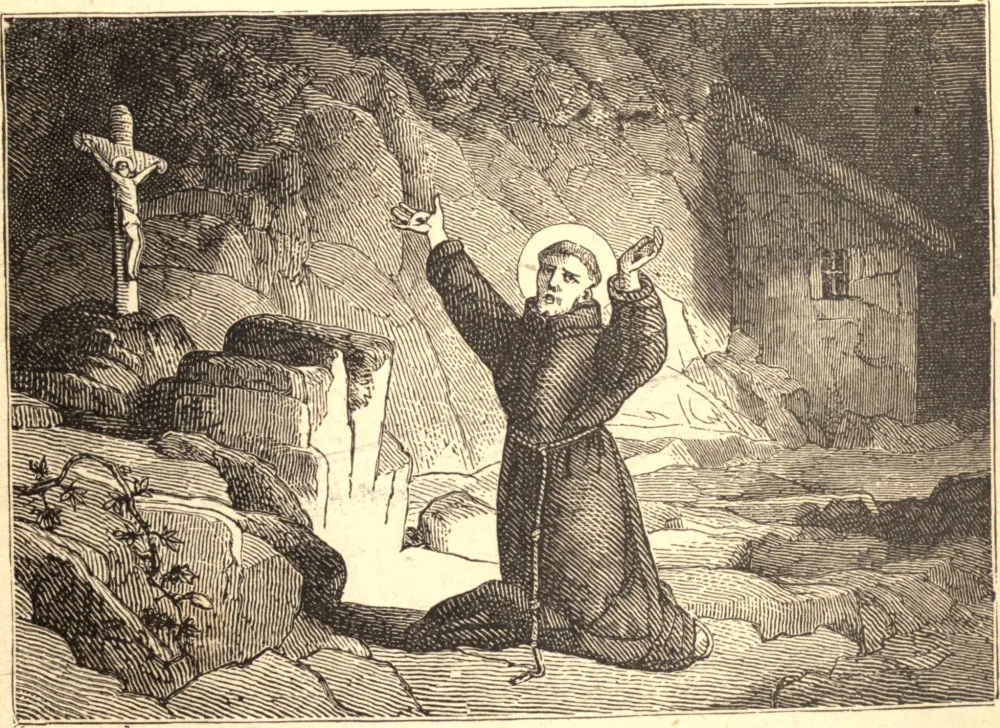

# 4 de outubro — SÃO FRANCISCO DE ASSIS

SÃO FRANCISCO, filho de um mercador de Assis, nasceu naquela cidade em 1182. Escolhido por Deus para ser uma viva manifestação ao mundo da vida pobre e sofredora de Cristo na terra, foi desde cedo inspirado com elevada estima e ardente amor à pobreza e à humilhação. O pensamento do Homem das Dores, que não tinha onde reclinar a cabeça, enchia-o de santa inveja dos pobres, e constrangia-o a renunciar à riqueza e à posição mundana que abominava. O escárnio e o duro tratamento que recebeu de seu pai e de seus conterrâneos quando apareceu entre eles nas vestes da pobreza eram-lhe deleitáveis. "Agora", exclamava ele, "posso dizer verdadeiramente: 'Pai Nosso que estais nos céus.'"

Mas o amor divino ardia nele com demasiada força para não acender semelhantes desejos em outros corações. Muitos se uniram a ele, e foram constituídos pelo Papa Inocêncio III em uma Ordem religiosa, que se espalhou rapidamente por toda a cristandade.

São Francisco, depois de visitar o Oriente na vã busca do martírio, passou a vida como seu Divino Mestre — ora pregando às multidões, ora em meio às solidões do deserto, em jejum e contemplação. Durante um destes retiros recebeu nas mãos, nos pés e no lado a impressão das cinco chagas sangrentas de Jesus. Com o grito: "Bem-vinda, irmã Morte", passou para a glória de seu Deus em 4 de outubro de 1226.

**Reflexão**—"Meu Deus e meu tudo", a constante oração de São Francisco, explica tanto a sua pobreza quanto a sua riqueza.
