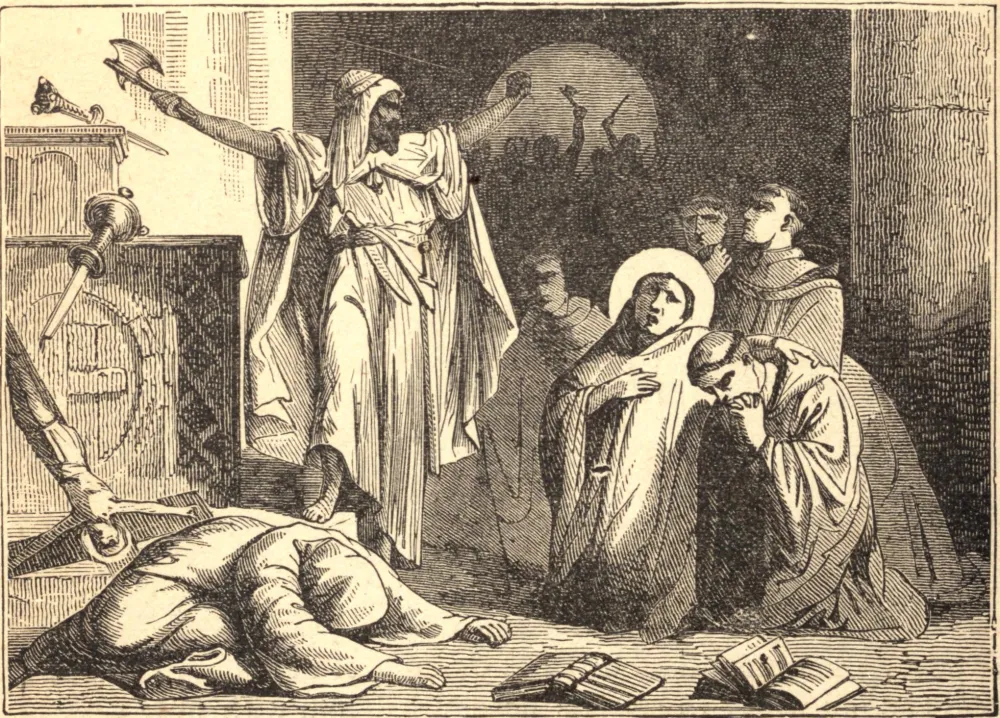

# 5 de outubro — SÃO PLÁCIDO, Mártir

SÃO PLÁCIDO nasceu em Roma, no ano de 515, de uma família patrícia, e aos sete anos de idade foi levado por seu pai ao mosteiro de Subiaco. Aos treze anos de idade seguiu São Bento à nova fundação de Monte Cassino, onde cresceu na prática de uma admirável austeridade e inocência de vida. Mal havia completado seu vigésimo primeiro ano quando foi escolhido para estabelecer um mosteiro na Sicília, em algumas propriedades que haviam sido dadas por seu pai a São Bento. Passou quatro anos construindo seu mosteiro, e o quinto ainda não decorrera quando uma incursão de bárbaros incendiou tudo até o chão, e deu uma morte lenta não apenas a São Plácido e a trinta monges que se haviam unido a ele, mas também a seus dois irmãos, Eutíquio e Vitorino, e a sua santa irmã Flávia, que viera visitá-lo. O mosteiro foi reconstruído, e ainda subsiste sob a sua invocação.

## Reflexão

A adversidade é a pedra de toque da alma, porque revela o caráter da virtude que ela possui. Um ato de ação de graças quando as coisas nos correm mal vale mais que mil agradecimentos quando as coisas estão conforme as nossas inclinações.
