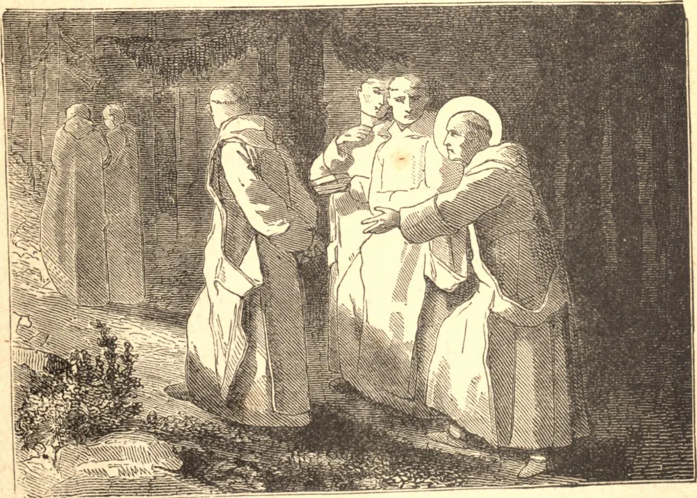

# 6 de outubro — SÃO BRUNO

BRUNO nasceu em Colônia, por volta de 1030, de uma família ilustre. Foi dotado de raros dons naturais, que cultivou com cuidado em Paris. Tornou-se cônego de Colônia, e depois de Reims, onde teve a direção dos estudos teológicos. Por morte do bispo, a sé caiu por algum tempo em más mãos, e Bruno retirou-se com alguns amigos para o campo. Ali resolveu abandonar o mundo, e viver uma vida de retiro e penitência. Com seis companheiros, dirigiu-se a Hugo, Bispo de Grenoble, que os conduziu a uma agreste solidão chamada Cartuxa. Ali viviam em pobreza, abnegação e silêncio, cada um à parte em sua própria cela, reunindo-se apenas para o culto a Deus, e ocupando-se em copiar livros. Do nome do lugar a Ordem de São Bruno foi chamada Cartuxa. Seis anos depois, Urbano II chamou Bruno a Roma, para que pudesse valer-se de sua orientação. Bruno procurou viver ali como vivera no deserto; mas os ecos da grande cidade perturbavam sua solidão, e, depois de recusar altas dignidades, arrancou do Papa a permissão de retomar sua vida monástica na Calábria. Ali viveu, em humildade e mortificação e grande paz, até a sua bendita morte em 1101.

## Reflexão

"Ó reino eterno", disse Santo Agostinho; "reino de idades sem fim, sobre o qual repousa a luz imperturbável e a paz de Deus que excede todo entendimento, onde as almas dos Santos estão em descanso, e a alegria eterna está sobre suas cabeças, e a tristeza e o gemido fugiram para longe! Quando virei e aparecerei diante de Deus?"
