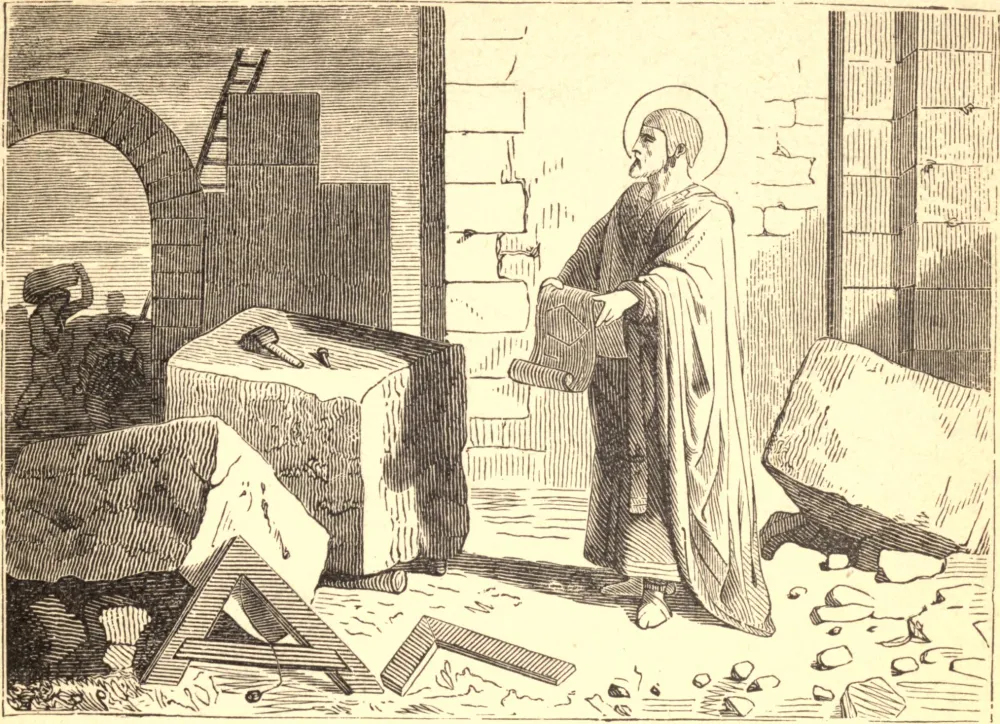

# 7 de outubro — SÃO MARCOS, Papa

SÃO MARCOS era romano de nascimento, e servia a Deus com tanto fervor entre o clero daquela Igreja que, avançando continuamente em sincera humildade e no conhecimento e sentimento de sua própria fraqueza e imperfeições, esforçava-se a cada dia por superar a si mesmo no fervor de sua caridade e zelo, e no exercício de todas as virtudes. A perseguição cessou no Ocidente, no princípio do ano de 305, mas foi reavivada pouco tempo depois por Maxêncio. São Marcos em nada diminuiu sua vigilância, mas antes procurou redobrar seu zelo durante a paz da Igreja; sabendo que, se os homens às vezes cessam de perseguir abertamente os fiéis, o demônio nunca lhes concede trégua alguma, e suas ciladas são geralmente mais de temer no tempo da calmaria. São Marcos sucedeu a São Silvestre na cátedra apostólica no dia 18 de janeiro de 336. Ocupou aquela dignidade apenas oito meses e vinte dias, morrendo no dia 7 de outubro seguinte. Foi sepultado em um cemitério na Via Ardeatina, que desde então tem levado o seu nome.

## Reflexão

Um cristão não deve temer nenhum inimigo mais do que a si mesmo, a quem carrega sempre consigo, e de quem não é capaz de fugir. Por isso, jamais deveria cessar de clamar a Deus: "Se Tu, ó Senhor, não és a minha luz e o meu sustentáculo, em vão velo."
