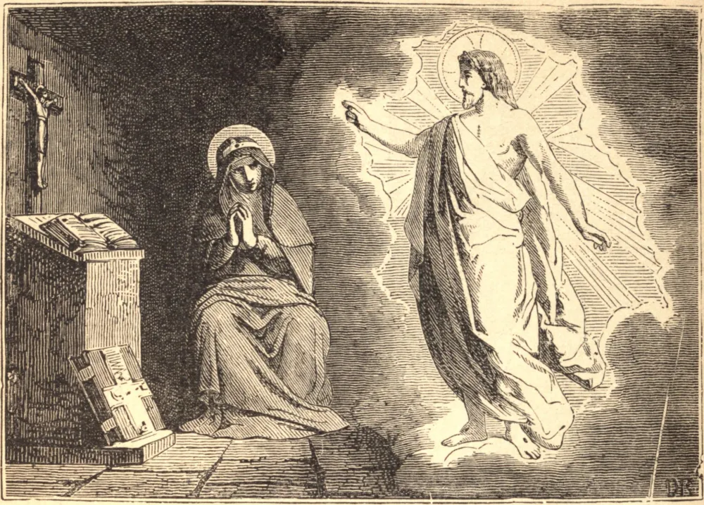

# 8 de outubro — SANTA BRÍGIDA DA SUÉCIA

SANTA BRÍGIDA nasceu da família real sueca, em 1304. Em obediência a seu pai, foi casada com o Príncipe Ulfo da Suécia, e tornou-se mãe de oito filhos, uma das quais, Catarina, é honrada como Santa.

Após alguns anos, ela e seu marido separaram-se por mútuo consentimento. Ele entrou na Ordem Cisterciense, e Brígida fundou a Ordem do Santíssimo Salvador, na Abadia de Wastein, na Suécia.

Em 1344 ficou viúva, e dali em diante recebeu uma série das mais sublimes revelações, todas as quais submeteu escrupulosamente ao juízo de seu confessor. Por ordem de Nosso Senhor, Brígida foi em peregrinação à Terra Santa, e em meio aos próprios cenários da Paixão foi ainda mais instruída nos sagrados mistérios. Morreu em 1373.

**Reflexão**—"Acaso é a confissão uma questão de muito tempo ou despesa?", pergunta São João Crisóstomo. "É um remédio difícil e penoso? Sem custo nem dano, o medicamento está sempre pronto para te restituir à perfeita saúde."
