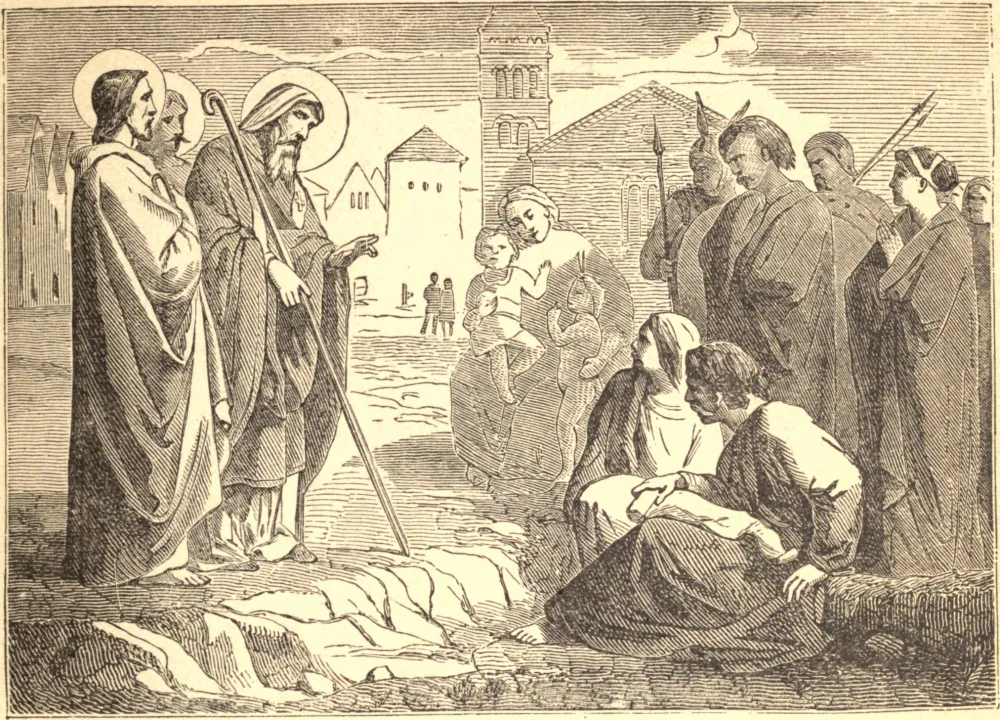

# 9 de outubro — SÃO DIONÍSIO e seus Companheiros, Mártires. — SÃO LUÍS BERTRANDO

DE todos os missionários romanos enviados à Gália, São Dionísio levou a Fé mais longe pelo país, fixando sua sé em Paris, e por ele e seus discípulos foram erigidas, no século quarto, as sés de Chartres, Senlis, Meaux e Colônia. Durante a perseguição de Valeriano foi preso e lançado no cárcere, e, depois de permanecer ali por algum tempo, foi decapitado, juntamente com São Rústico, sacerdote, e Eleutério, diácono.

SÃO LUÍS BERTRANDO nasceu em Valência, na Espanha, em 1526, da mesma família de São Vicente Ferrer. Em 1545, após severas provações, fez profissão na Ordem Dominicana, e aos vinte e cinco anos foi feito mestre de noviços, e formou muitos grandes servos de Deus. Quando a peste irrompeu em Valência, dedicou-se aos enfermos e moribundos, e com as próprias mãos sepultou os mortos.

Em 1562 obteve licença para embarcar para a missão americana, e ali converteu vastas multidões à Fé. Foi favorecido com o dom dos milagres, e, enquanto pregava em seu espanhol nativo, era compreendido em várias línguas.

Após sete anos voltou à Espanha, para defender a causa dos índios oprimidos, mas não lhe foi permitido regressar e trabalhar entre eles. Passou seus dias restantes labutando em sua própria pátria, até que enfim, em 1580, foi levado do púlpito da Catedral de Valência ao leito do qual nunca mais se levantou. Morreu no dia que havia predito — 9 de outubro de 1581.

**Reflexão**—Os Santos jejuaram, labutaram e choraram, não apenas por amor de Deus, mas por temor da condenação. Como haveremos nós, com nossas vidas de autoindulgência e nossas consciências não examinadas, de enfrentar o tribunal de Cristo?
