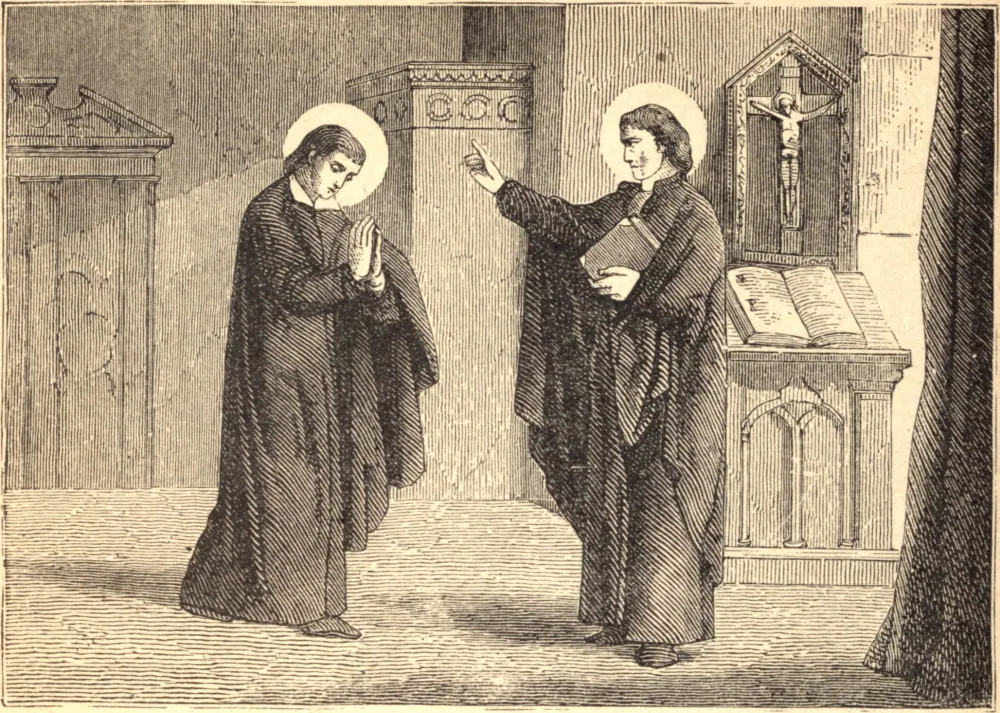

# 10 de outubro — SÃO FRANCISCO DE BORJA

FRANCISCO DE BORJA, Duque de Gandia e Capitão-General da Catalunha, era um dos mais belos, ricos e honrados nobres da Espanha, quando, em 1539, foi-lhe imposto o triste dever de escoltar os restos de sua soberana, a Rainha Isabel, ao sepulcro real em Granada. O caixão teve de ser aberto para ele, a fim de que pudesse verificar o corpo antes que fosse colocado no túmulo, e visão tão repugnante se deparou aos seus olhos que ele fez voto de jamais voltar a servir a um soberano que pudesse sofrer mudança tão vil. Passaram-se alguns anos antes que pudesse seguir o chamado de seu Senhor; por fim entrou na Companhia de Jesus para cortar a si mesmo de qualquer possibilidade de dignidade ou promoção. Mas sua Ordem o escolheu para ser seu chefe. Os turcos ameaçavam a cristandade, e São Pio V enviou seu sobrinho para reunir os príncipes cristãos em uma liga para sua defesa. O santo Papa escolheu Francisco para acompanhá-lo, e, embora estivesse exausto, o Santo obedeceu imediatamente. As fadigas da embaixada esgotaram o pouco de vida que lhe restava. São Francisco morreu em seu regresso a Roma, em 10 de outubro de 1572.

## Reflexão

São Francisco de Borja aprendeu a inutilidade da grandeza terrena no funeral da Rainha Isabel. Acaso as mortes dos amigos nos ensinam algo acerca de nós mesmos?
