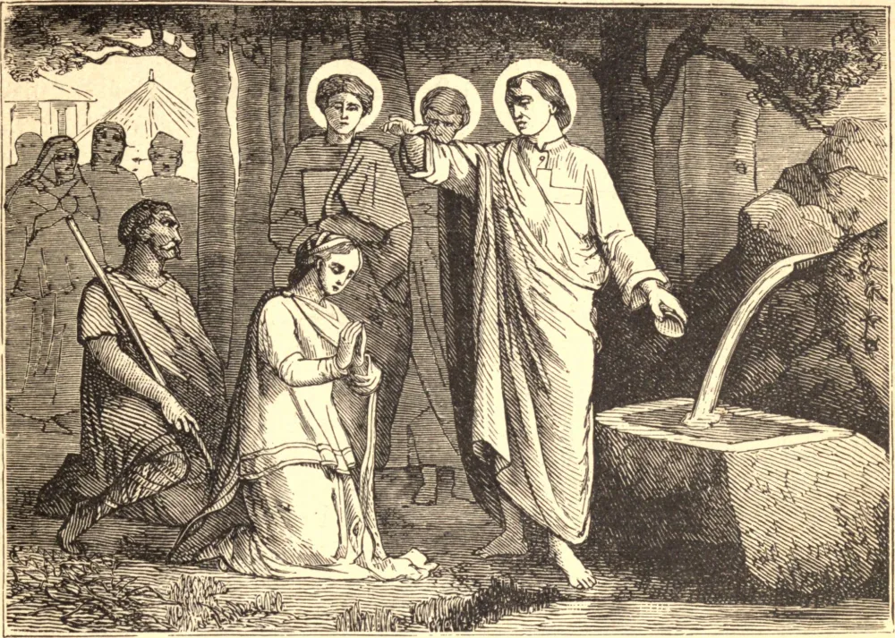

# 11 de outubro — SÃO TARACO e seus Companheiros

NO ano de 304, Taraco, Probo e Andrônico, diferentes em idade e nacionalidade, mas unidos nos laços da fé, sendo denunciados como cristãos a Numeriano, Governador da Cilícia, foram presos em Pompeiópolis e conduzidos a Tarso. Sofreram um primeiro interrogatório naquela cidade, após o qual seus membros foram dilacerados com ganchos de ferro, e foram levados de volta à prisão cobertos de feridas. Sendo depois conduzidos a Mopsuéstia, foram submetidos a um segundo interrogatório, terminando de maneira igualmente cruel como o primeiro. Sofreram um terceiro interrogatório em Anazarbo, seguido de tormentos ainda maiores. O governador, incapaz de abalar a constância deles, mandou que fossem mantidos presos para que pudesse torturá-los ainda mais nos jogos que se aproximavam. Foram levados ao anfiteatro, mas os animais mais ferozes, ao serem soltos sobre eles, vieram agachando-se a seus pés e lambendo suas feridas. O juiz, repreendendo os carcereiros por conivência, ordenou que os mártires fossem mortos pelos gladiadores.

## Reflexão

Tal é a verdadeira devoção cristã. "Nem a morte nem a vida poderão separar-nos do amor que está em Cristo Jesus."
