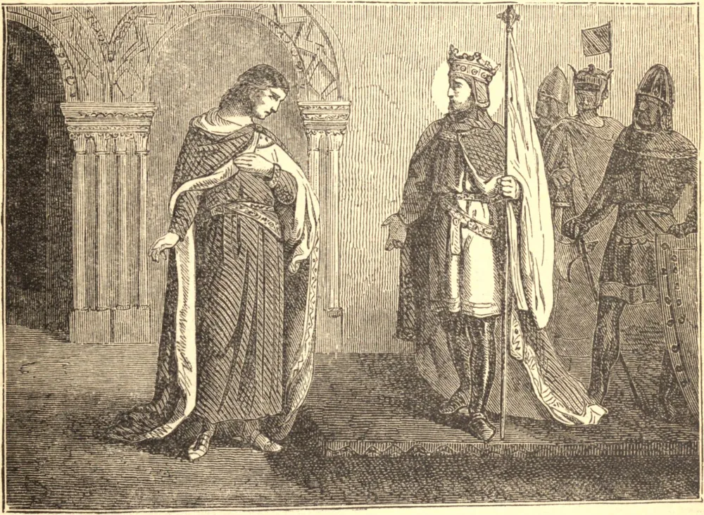

# 13 de outubro — SANTO EDUARDO, O CONFESSOR

EDUARDO foi inesperadamente elevado ao trono da Inglaterra aos quarenta anos de idade, vinte e sete dos quais havia passado no exílio. No trono, as virtudes de seus primeiros anos, a simplicidade, a brandura, a humildade, mas sobretudo sua angélica pureza, brilharam com novo esplendor. Por rara inspiração de Deus, embora se casasse para contentar seus nobres e seu povo, conservou perfeita castidade no estado conjugal.

Tão pouco punha ele o coração nas riquezas, que por três vezes, ao ver um servo roubando seu tesouro, deixou-o escapar, dizendo que o pobre homem precisava do ouro mais do que ele. Gostava de postar-se ao portão de seu palácio, falando com bondade aos pobres mendigos e leprosos que se aglomeravam ao seu redor, e a muitos dos quais curou de suas doenças.

As longas guerras haviam reduzido o reino a um triste estado, mas o zelo e a santidade de Eduardo logo operaram uma grande mudança. Seu reinado de vinte e quatro anos foi de paz quase ininterrupta, o país tornou-se próspero, as igrejas arruinadas ergueram-se sob sua mão, os fracos viviam seguros, e por séculos depois os homens falavam com afeto das "leis do bom Santo Eduardo". O santo rei tinha grande devoção a edificar e enriquecer igrejas. A Abadia de Westminster foi sua última e mais nobre obra. Morreu em 5 de janeiro de 1066.

**Reflexão**—Davi ansiava por edificar um templo para o serviço de Deus. Salomão tinha por glória sua realizar a obra. Mas nós, que temos Deus feito carne habitando em nossos tabernáculos, não devemos julgar tempo algum, zelo algum, tesouro algum demasiado para consagrar ao esplendor e à beleza de uma igreja cristã.
