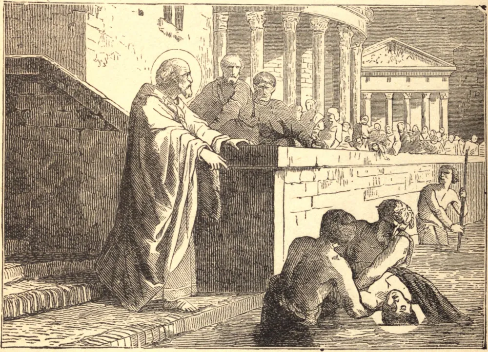

# 14 de outubro — SÃO CALISTO, Papa, Mártir

NO início do terceiro século, Calisto, então diácono, foi encarregado pelo Papa São Zeferino do governo do clero, e por ele posto à frente dos cemitérios dos cristãos em Roma; e, à morte de Zeferino, Calisto, segundo o uso romano, sucedeu na Sé Apostólica. Atribui-se-lhe um decreto que instituiu os quatro jejuns das Têmporas, mas seu nome é mais conhecido em ligação com o antigo cemitério da Via Ápia, que por ele foi ampliado e adornado, e que se chama até hoje a Catacumba de São Calisto. Durante a perseguição sob o Imperador Severo, São Calisto foi obrigado a buscar abrigo nos bairros pobres e populosos da cidade; contudo, apesar destes transtornos e do cuidado da Igreja, fez diligente busca pelo corpo de Calipódio, um de seus clérigos que pouco antes havia sofrido o martírio, sendo lançado ao Tibre. Quando o encontrou, ficou cheio de alegria, e o sepultou com hinos de louvor. Calisto foi martirizado em 14 de outubro de 223.

## Reflexão

No corpo de um cristão vemos aquilo que foi o templo do Espírito Santo, que ainda agora é precioso aos olhos de Deus, que velará sobre ele, e que um dia o ressuscitará em glória para resplandecer para sempre em Seu reino. Que nossas ações dêem testemunho de nossa crença nestas verdades.
