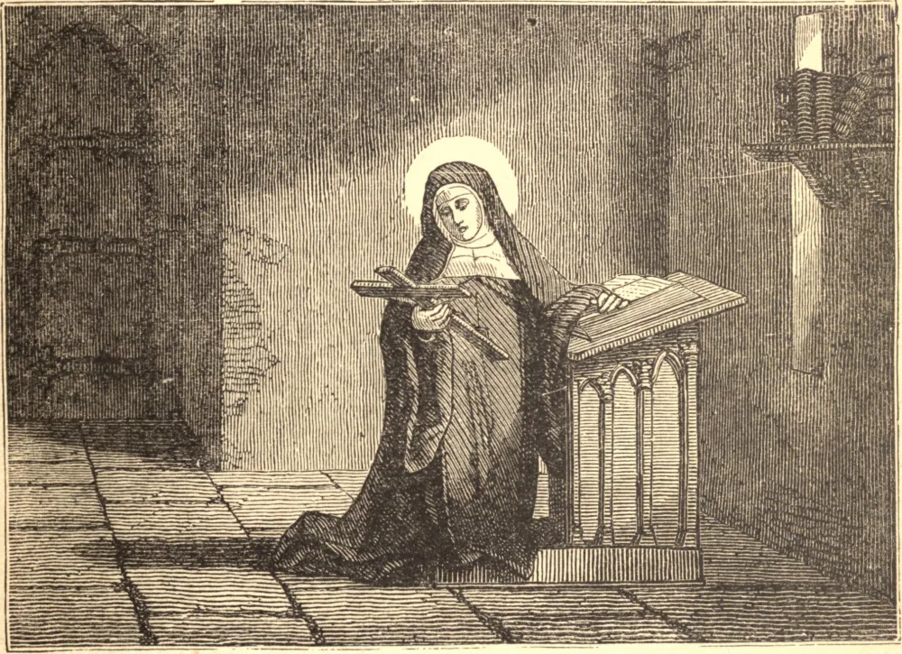

# 15 de outubro — SANTA TERESA

QUANDO criança de sete anos, Teresa fugiu de sua casa em Ávila, na Espanha, na esperança de ser martirizada pelos mouros. Sendo trazida de volta e indagada sobre a razão de sua fuga, respondeu: "Quero ver Deus, e devo morrer antes de poder vê-Lo." Começou então com seu irmão a construir uma ermida no jardim, e era amiúde ouvida repetindo "Para sempre, para sempre."

Alguns anos depois, tornou-se freira carmelita. Conversas frívolas detiveram seu progresso rumo à perfeição, mas enfim, em seu trigésimo primeiro ano, entregou-se inteiramente a Deus. Uma visão mostrou-lhe o próprio lugar no inferno ao qual suas próprias faltas leves a teriam levado, e ela viveu desde então na mais profunda desconfiança de si mesma.

Foi chamada a reformar sua Ordem, favorecida com ordens distintas de Nosso Senhor, e seu coração foi traspassado pelo amor divino; mas nada temia tanto quanto a ilusão, e até o fim agiu apenas sob a obediência a seus confessores, o que ao mesmo tempo a tornava forte e a mantinha segura. Morreu em 4 de outubro de 1582.

**Reflexão**—"Afinal, morro filha da Igreja." Estas foram as últimas palavras da Santa. Ensinam-nos a lição de sua vida — confiar na humilde e infantil obediência a nossos guias espirituais como o mais seguro meio de salvação.
