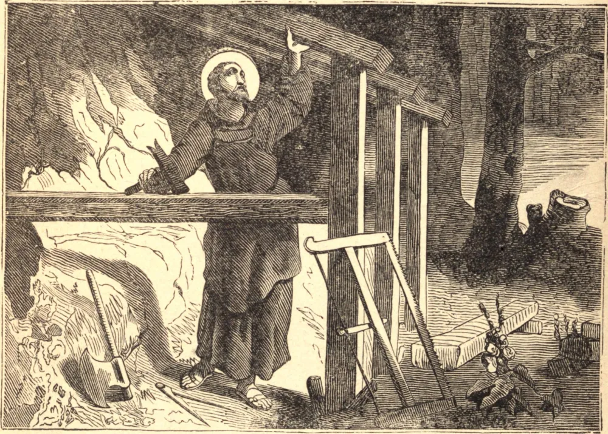

# 16 de outubro — SÃO GALO, Abade

SÃO GALO nasceu na Irlanda pouco depois de meados do século sexto, de pais piedosos, nobres e ricos. Quando São Columbano deixou a Irlanda, São Galo o acompanhou à Inglaterra, e depois à França, onde chegaram em 585. São Columbano fundou o mosteiro de Anegray, numa floresta selvagem na diocese de Besançon, e dois anos depois outro em Luxeuil. Sendo dali expulsos pelo Rei Teodorico, os Santos retiraram-se ambos para os territórios de Teodeberto. São Columbano, contudo, retirou-se para a Itália, mas São Galo foi impedido de lhe fazer companhia por um grave acesso de enfermidade.

São Galo era sacerdote antes de deixar a Irlanda, e, tendo aprendido a língua da região onde se estabeleceu, junto ao Lago de Constança, converteu à fé um grande número de idólatras. As celas que este Santo ali construiu para os que desejavam servir a Deus com ele, deu-as ao mosteiro que leva o seu nome. Um sínodo de bispos, com o clero e o povo, desejou ardentemente colocar o Santo na sé episcopal de Constança; mas sua modéstia recusou a dignidade. Morreu no ano de 646.

**Reflexão**—"Se alguém quiser ser Meu discípulo", diz Nosso Salvador, "negue-se a si mesmo." A negação de si mesmo é, pois, o caminho real para a perfeição.
