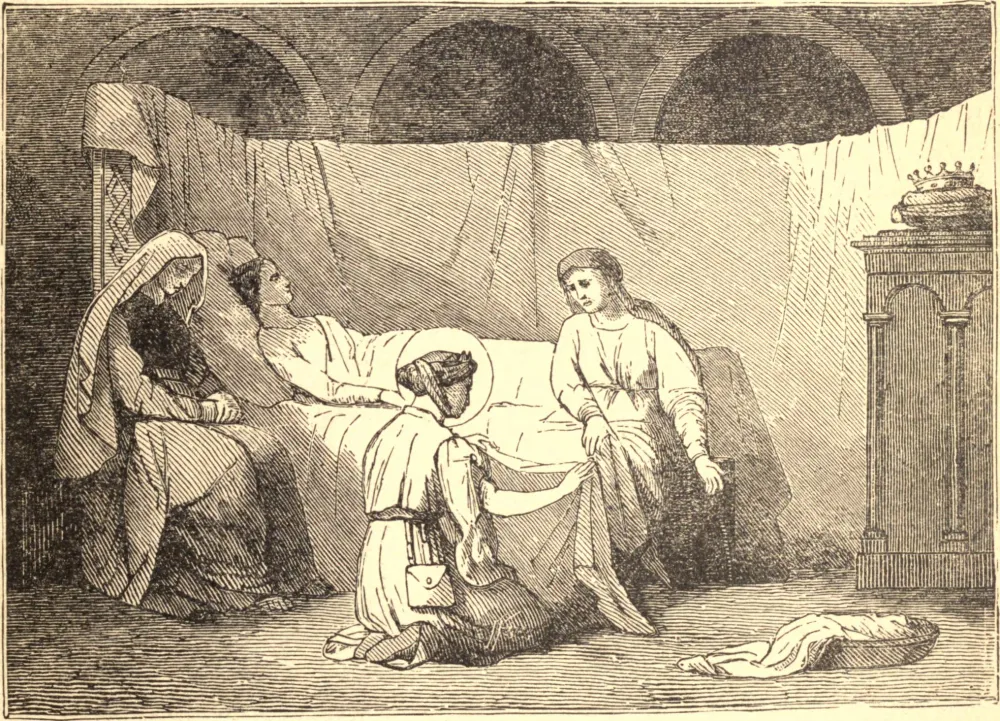

# 17 de outubro — SANTA EDVIGES.—SANTA MARGARIDA MARIA ALACOQUE

SANTA EDVIGES, esposa de Henrique, Duque da Silésia, e mãe de seus seis filhos, levou uma vida humilde, austera e santíssima em meio a toda a pompa do estado real. A devoção ao Santíssimo Sacramento foi a nota dominante de sua vida. Seu privilégio estimado era fornecer o pão e o vinho para os Sagrados Mistérios, e ela assistia cada manhã a tantas Missas quantas se celebrassem. Após a morte de seu esposo, retirou-se para o convento cisterciense de Trebnitz, onde viveu sob a obediência de sua filha Gertrudes, que era abadessa do mosteiro, crescendo de dia em dia em santidade, até que Deus a chamou a Si, em 1242.

MARGARIDA MARIA nasceu em Terreau, na Borgonha, em 22 de julho de 1647. Durante sua infância, mostrou um horror maravilhosamente sensível à própria ideia do pecado. Em 1671 entrou na Ordem da Visitação, em Paray-le-Monial, e fez profissão no ano seguinte. Após purificá-la por muitas provações, Jesus apareceu-lhe em numerosas visões, mostrando-lhe Seu Sagrado Coração, ora ardendo como uma fornalha, ora dilacerado e sangrando por causa da frieza e dos pecados dos homens. Em 1675 foi-lhe feita a grande revelação de que ela, em união com o Padre de la Colombière, da Companhia de Jesus, havia de ser o principal instrumento para instituir a festa do Sagrado Coração e para difundir essa devoção por todo o mundo. Morreu em 17 de outubro de 1690.

**Reflexão**—O amor pelo Sagrado Coração honra de modo especial a Encarnação, e faz a alma crescer rapidamente em humildade, generosidade, paciência e união com o seu Amado.
