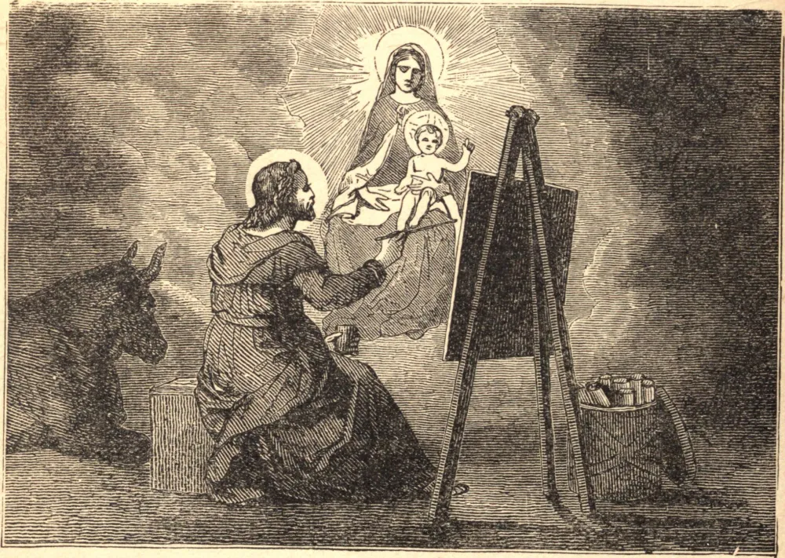

# 18 de outubro — SÃO LUCAS

SÃO LUCAS, médico em Antioquia e pintor, tornou-se convertido de São Paulo, e depois seu companheiro de trabalho. É mais conhecido de nós como o historiador do Novo Testamento. Embora não fosse testemunha ocular da vida de Nosso Senhor, o Evangelista reuniu diligentemente informações dos lábios dos apóstolos, e escreveu, como ele mesmo nos diz, todas as coisas por ordem. Os Atos dos Apóstolos foram escritos por este Evangelista como continuação de seu Evangelho, levando a história da Igreja até o primeiro encarceramento de São Paulo em Roma. O humilde historiador nunca se nomeia, mas pelo seu uso ocasional de "nós" em vez de "eles" podemos detectar a sua presença nas cenas que descreve. Assim verificamos que navegou com São Paulo e Silas de Trôade para a Macedônia; permaneceu, ao que parece, por sete anos em Filipos, e, por fim, partilhou o naufrágio e os perigos da memorável viagem a Roma. Aqui termina sua própria narrativa, mas pelas Epístolas de São Paulo aprendemos que São Lucas foi seu fiel companheiro até o fim. Morreu com a morte de mártir algum tempo depois, na Acaia.

## Reflexão

Cristo deu tudo o que tinha por ti; dá tu tudo o que tens por Ele.
