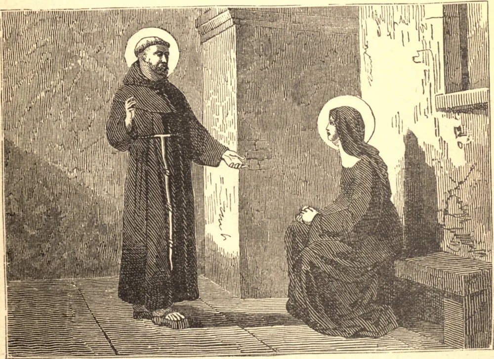

# 19 de outubro — SÃO PEDRO DE ALCÂNTARA

PEDRO, ainda jovem, deixou sua casa em Alcântara, na Espanha, e entrou num convento de Franciscanos Descalços. Subiu rapidamente a altos postos na Ordem, mas sua sede de penitência ainda não estava saciada, e em 1539, tendo então quarenta anos, fundou o primeiro convento da "Estrita Observância". As celas dos frades assemelhavam-se mais a túmulos do que a moradias. A do próprio São Pedro tinha quatro pés e meio de comprimento, de modo que ele nunca podia deitar-se; comia apenas uma vez a cada três dias; seu hábito de cilício e uma capa eram suas únicas vestes, e nunca cobria a cabeça ou os pés. No rigoroso inverno, abria a porta e a janela de sua cela para que, ao fechá-las de novo, pudesse experimentar alguma sensação de calor. Entre aqueles que ele conduziu à perfeição estava Santa Teresa. Leu-lhe a alma, aprovou seu espírito de oração, e fortaleceu-a para levar a cabo suas reformas. São Pedro morreu, com grande alegria, ajoelhado em oração, em 18 de outubro de 1562, à idade de sessenta e três anos.

## Reflexão

Se os homens hoje não andam descalços, nem se submetem a penitências agudas, como São Pedro fazia, há muitas maneiras de pisar o mundo; e Nosso Senhor as ensina quando encontra a coragem necessária.
