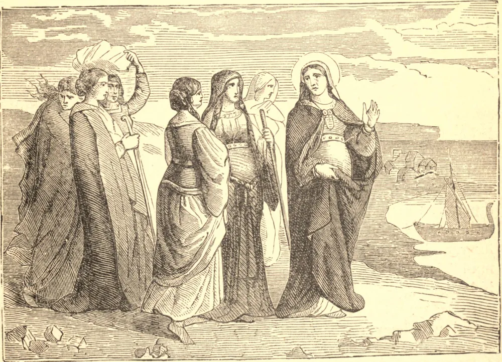

# 21 de outubro — SANTA ÚRSULA, Virgem e Mártir

UM número de famílias cristãs havia confiado a educação de seus filhos aos cuidados da piedosa Úrsula, e algumas pessoas do mundo haviam, de igual modo, colocado-se sob sua direção. Estando então a Inglaterra atormentada pelos saxões, Úrsula julgou que devia, seguindo o exemplo de muitos de seus compatriotas, buscar asilo na Gália. Encontrou um lugar de morada às margens do Reno, não longe de Colônia, onde esperava encontrar repouso tranquilo; mas, tendo uma horda de hunos invadido a região, ficou exposta, juntamente com todas as que estavam sob sua guarda, aos mais vergonhosos ultrajes. Sem vacilar, preferiram todas, sem exceção, enfrentar a morte a incorrer na desonra. A própria Úrsula deu o exemplo, e foi, juntamente com suas companheiras, cruelmente massacrada no ano de 453.

O nome de Santa Úrsula desde tempos remotos tem sido tido em grande honra por toda a Igreja; sempre foi considerada a padroeira das pessoas jovens e o modelo das mestras.

**Reflexão**—Na estimação do sábio, "a guarda da virtude" é a parte mais importante da educação da juventude.
