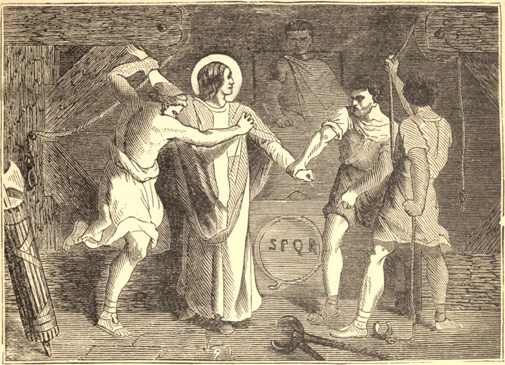

# 23 de outubro — SÃO TEODORETO, Mártir

POR volta do ano 361, Juliano, tio do imperador daquele nome e, como o sobrinho, um apóstata, foi feito Conde do Oriente. Fechou as igrejas cristãs em Antioquia e, quando São Teodoreto reuniu os cristãos em particular, foi intimado a comparecer perante o tribunal do Conde e torturado de maneira sumamente desumana. Seus braços e pés foram presos por cordas a roldanas e estirados até que seu corpo parecesse ter quase dois metros e meio de comprimento, e o sangue jorrava de seus flancos.

"Ó homem miserabilíssimo", disse ele ao seu juiz, "bem sabes que no dia do juízo o Deus crucificado a Quem blasfemas enviará a ti e ao tirano a quem serves para o inferno." Juliano tremeu diante desta terrível profecia, mas fez despachar o Santo rapidamente pela espada, e em pouco tempo o próprio juiz foi arrastado perante o tribunal do juízo de Deus.

**Reflexão**—Aqueles que não descem ao inferno em espírito são muito propensos a ir para lá na realidade. Cuida de meditar sobre as quatro últimas coisas e de viver no santo temor. Aprenderás a amar a Deus melhor pensando em como Ele castiga aqueles que não O amam.
