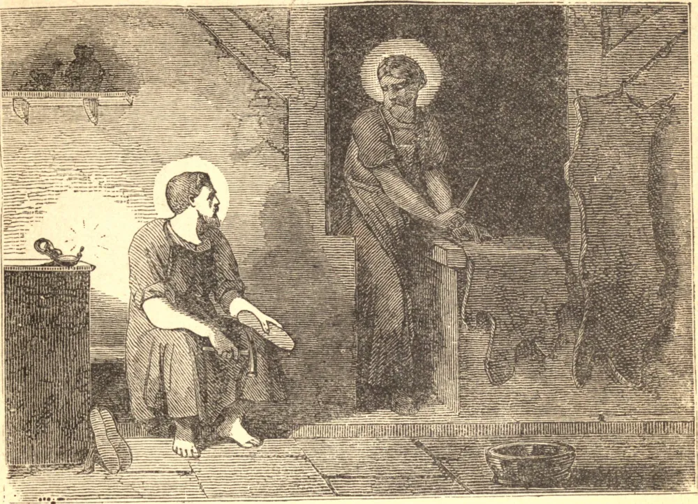

# 25 de outubro — SÃO CRISPIM e SÃO CRISPINIANO, Mártires

ESTES dois gloriosos mártires vieram de Roma para pregar a Fé na Gália em meados do século terceiro. Fixando sua residência em Soissons, instruíram muitos na Fé de Cristo, que pregavam publicamente de dia, e à noite trabalhavam fazendo sapatos, embora se diga que fossem de nascimento nobre, e irmãos. Os infiéis escutavam suas instruções e ficavam admirados com o exemplo de suas vidas, especialmente de sua caridade, desprendimento, piedade celestial e desprezo pela glória e por todas as coisas terrenas; e o efeito foi a conversão de muitos à fé cristã. Os irmãos haviam continuado em seu ofício por vários anos quando uma queixa foi apresentada contra eles. O imperador, para satisfazer seus acusadores e dar vazão à sua crueldade selvagem, deu ordens de que fossem levados perante Ríctio Varo, o mais implacável inimigo dos cristãos. Os mártires foram pacientes e constantes sob os mais cruéis tormentos, e terminaram seu curso pela espada por volta do ano 287.

## Reflexão

De quantos se pode dizer que "trabalham em vão", visto que Deus não é o fim e o propósito que inspira o trabalho?
