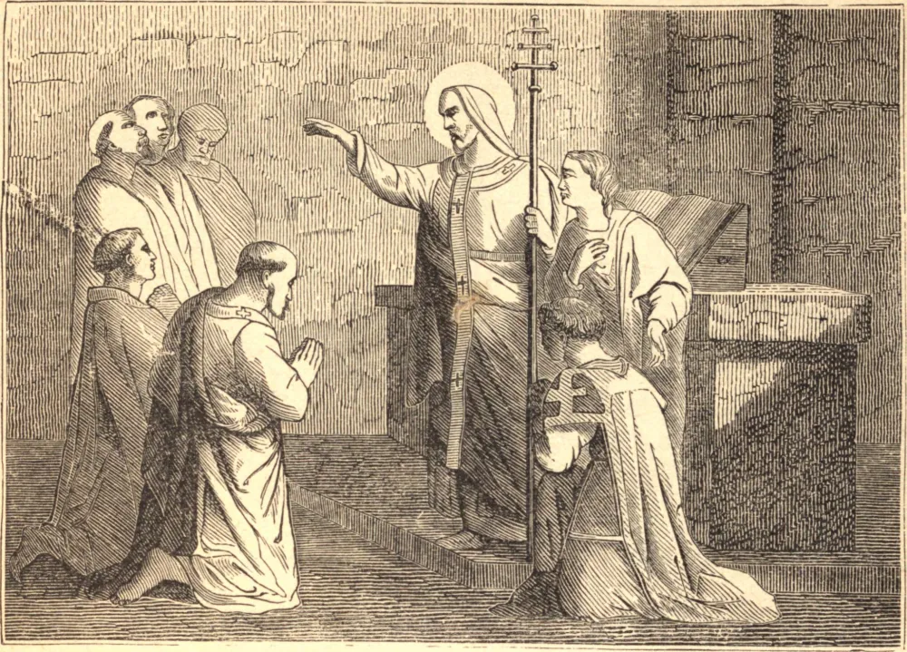

# 26 de outubro — SANTO EVARISTO, Papa e Mártir

SANTO EVARISTO sucedeu a Santo Anacleto na sé de Roma, no reinado de Trajano, governou a Igreja por nove anos e morreu em 112. A instituição dos sacerdotes cardeais é por alguns atribuída a ele, porque foi o primeiro a dividir Roma em vários títulos ou paróquias, designando um sacerdote a cada uma; também nomeou sete diáconos para assistir ao bispo. Conferiu as ordens sagradas três vezes no mês de dezembro, quando essa cerimônia era mais usualmente realizada, pois as ordens sagradas eram sempre conferidas nos tempos designados para o jejum e a oração. Santo Evaristo foi sepultado próximo ao túmulo de São Pedro, no Vaticano.

## Reflexão

Os discípulos dos apóstolos, pela assídua meditação nas coisas celestiais, estavam tão absortos na vida futura que pareciam já não ser habitantes deste mundo. Se os cristãos estimam e põem seu coração nos bens terrenos, e perdem de vista a eternidade no curso de suas ações, já não são animados pelo espírito dos Santos primitivos, e tornaram-se filhos deste mundo, escravos de suas vaidades e de suas próprias paixões desregradas. Se não corrigirmos esta desordem de nossos corações, e não conformarmos o nosso interior ao espírito de Cristo, não poderemos ter direito às Suas promessas.
