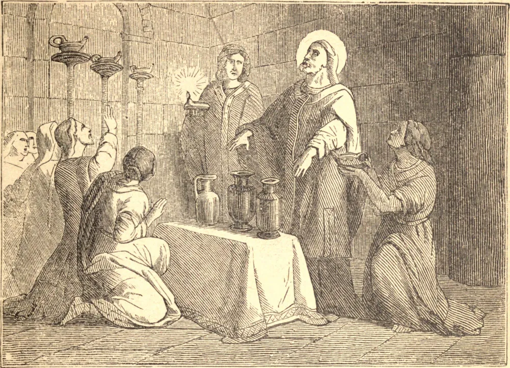

# 29 de outubro — SÃO NARCISO, Bispo

SÃO NARCISO foi sagrado Bispo de Jerusalém por volta do ano 180. Já era um homem idoso, e Deus atestou seus méritos por muitos milagres, que foram por longo tempo guardados na memória pelos cristãos de Jerusalém. Em certo Sábado Santo, na igreja, os fiéis estavam em grande aflição, porque não se encontrava azeite para as lâmpadas que eram usadas na festa Pascal. São Narciso mandou que tirassem água de um poço vizinho e, orando sobre ela, disse-lhes que a pusessem nas lâmpadas. Ela se transformou em azeite, e muito tempo depois um pouco deste azeite foi conservado em Jerusalém em memória do milagre. Mas a própria virtude do Santo lhe fez inimigos, e três homens miseráveis o acusaram de um crime atroz. Confirmaram seu testemunho com horríveis imprecações: o primeiro rogou que perecesse pelo fogo, o segundo que fosse consumido pela lepra, o terceiro que fosse ferido de cegueira, se acusassem falsamente seu bispo. O santo bispo havia por muito tempo desejado uma vida de solidão, e retirou-se secretamente para o deserto, deixando a Igreja em paz. Mas Deus falou em favor de Seu servo, e os acusadores do bispo sofreram as penas que haviam invocado. Então Narciso voltou a Jerusalém e retomou seu ofício. Morreu em idade extremamente avançada, bispo até o fim.

## Reflexão

Deus nunca falha àqueles que n'Ele confiam; Ele os guia através das trevas e das provações, secreta e seguramente, ao seu fim, e na hora da tarde haverá luz.
