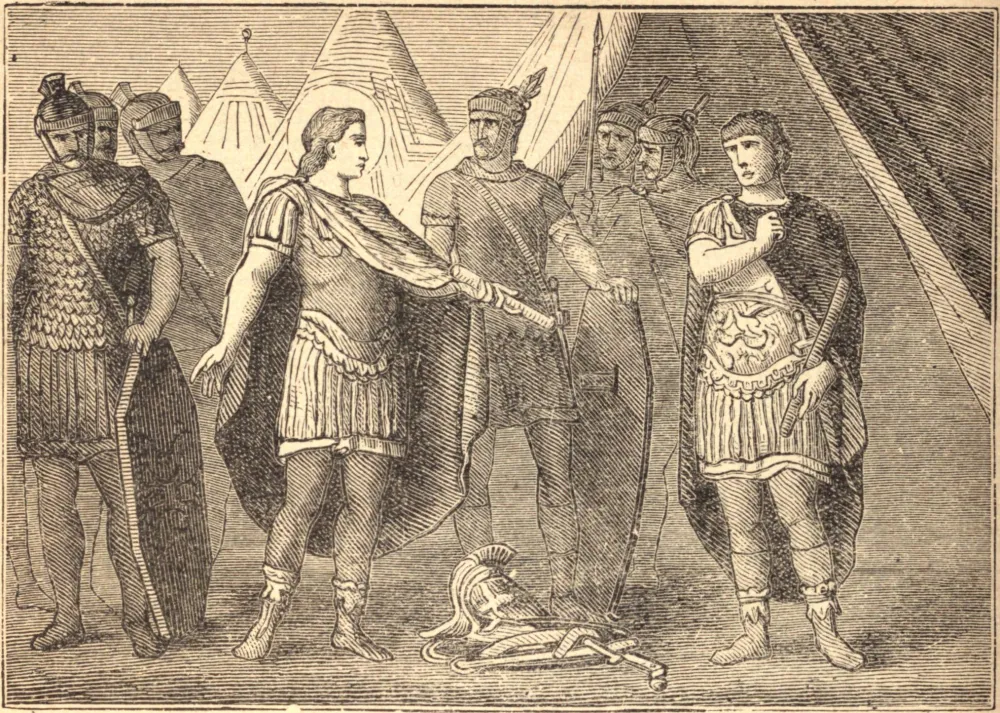

# 30 de outubro — SÃO MARCELO, O CENTURIÃO, Mártir

O aniversário do Imperador Maximiano Hercúleo, no ano 298, foi celebrado com extraordinário banquete e solenidade. Marcelo, um centurião ou capitão cristão na legião de Trajano, então estacionada na Espanha, para não se manchar tomando parte naquelas ímpias abominações, deixou sua companhia, declarando em voz alta que era soldado de Jesus Cristo, o Rei eterno. Foi imediatamente lançado na prisão. Quando a festa terminou, Marcelo foi levado perante um juiz e, tendo declarado sua fé, foi enviado sob forte guarda a Aureliano Agricolau, vigário do prefeito do pretório, que pronunciou contra ele sentença de morte. São Marcelo foi sem demora conduzido ao suplício, e decapitado no dia 30 de outubro. Cassiano, o secretário ou notário do tribunal, recusou-se a escrever a sentença pronunciada contra o mártir, porque era injusta. Foi imediatamente arrastado à prisão, e decapitado, cerca de um mês depois, no dia 3 de dezembro.

## Reflexão

"Estamos prontos a morrer antes que transgredir as leis de Deus!" exclamou um dos Macabeus. Este sentimento deve ser sempre o de um cristão em presença da tentação.
