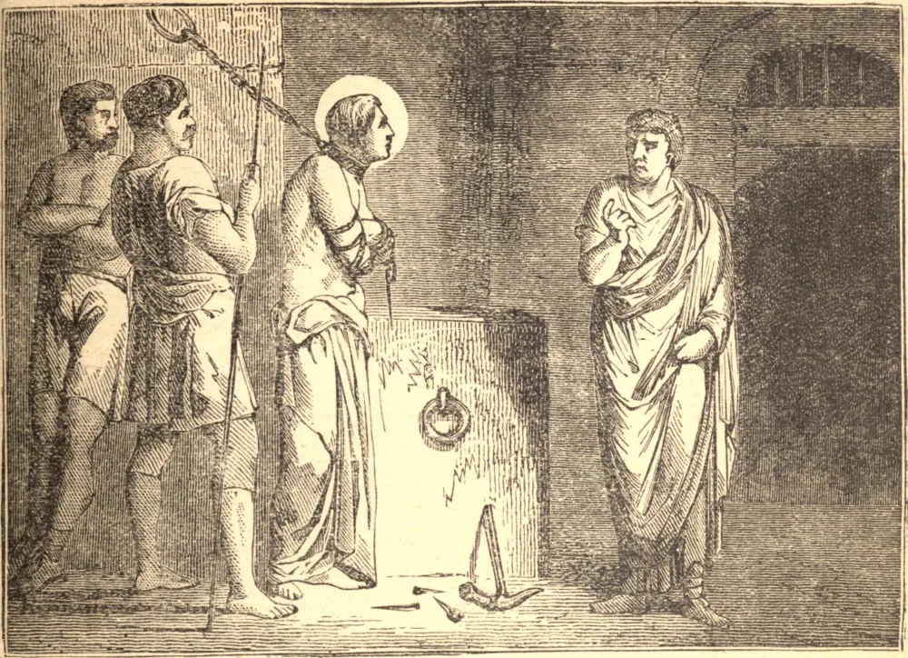

# 31 de outubro — SÃO QUINTINO, Mártir

SÃO QUINTINO era romano, descendente de uma família senatorial. Cheio de zelo pelo reino de Jesus Cristo, deixou sua pátria e, acompanhado por São Luciano de Beauvais, dirigiu-se à Gália. Pregaram juntos a Fé naquele país até chegarem a Amiens, na Picardia, onde se separaram. Luciano foi a Beauvais e, tendo semeado as sementes da fé divina nos corações de muitos, recebeu a coroa do martírio naquela cidade.

São Quintino permaneceu em Amiens, empenhando-se por suas orações e labores em fazer daquela região uma porção da herança de Nosso Senhor. Foi preso, lançado no cárcere e carregado de cadeias. Achando o santo pregador à prova de promessas e ameaças, o magistrado o condenou ao mais bárbaro suplício. Seu corpo foi então traspassado com dois fios de ferro, do pescoço às coxas, e cravos de ferro foram enfiados sob suas unhas, e em sua carne em muitos lugares, particularmente em seu crânio; e, por fim, sua cabeça foi cortada. Sua morte ocorreu no dia 31 de outubro de 287.

**Reflexão**—Tenhamos em mente que os males desta vida não são dignos de ser comparados com a glória que "Deus reservou para aqueles que O amam".
