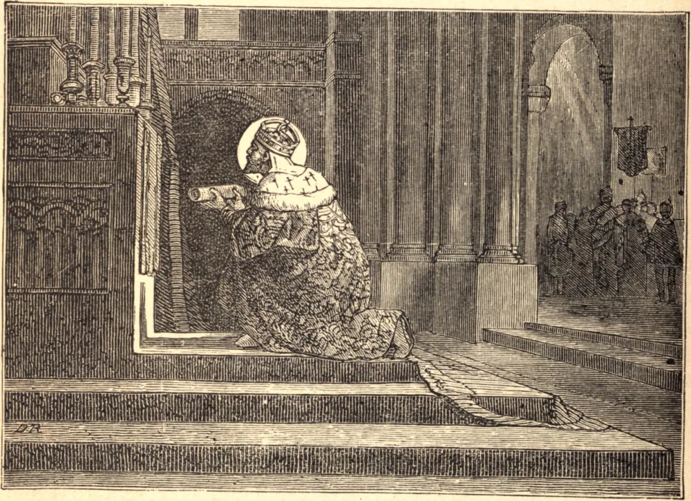

# 2 de setembro — SANTO ESTÊVÃO, Rei

GEISA, quarto Duque da Hungria, foi, com sua esposa, convertido à Fé, e viu numa visão o mártir Santo Estêvão, que lhe disse que teria um filho que aperfeiçoaria a obra que ele havia começado. Este filho nasceu em 977, e recebeu o nome de Estêvão. Foi educado com o maior cuidado, e sucedeu a seu pai em tenra idade.

Começou a extirpar a idolatria, sufocou uma rebelião de seus súditos pagãos, e fundou mosteiros e igrejas por toda a terra. Enviou ao Papa Silvestre, suplicando-lhe que nomeasse bispos para as onze sés que ele havia dotado, e que lhe concedesse, para o maior êxito de sua obra, o título de rei. O Papa atendeu aos seus pedidos, e enviou-lhe uma cruz a ser levada diante dele, dizendo que o tinha por verdadeiro apóstolo de seu povo.

Sua devoção era fervorosa. Pôs seus reinos sob a proteção de Nossa Senhora, e guardava a festa de sua Assunção com particular afeição. Deu boas leis, e zelou por sua execução. Por toda a sua vida, segundo nos é dito, teve Cristo nos lábios, Cristo no coração, e Cristo em tudo o que fazia. Suas únicas guerras foram guerras de defesa, e foi sempre vitorioso. Deus enviou-lhe muitas e duras provações. Um a um seus filhos morreram, mas ele suportou tudo com perfeita submissão à vontade de Deus.

Quando Santo Estêvão estava prestes a morrer, convocou os bispos e os nobres, e deu-lhes encargo a respeito da escolha de um sucessor. Depois exortou-os a nutrir e a estimar a Igreja Católica, que era ainda como uma tenra planta na Hungria, a seguir a justiça, a humildade e a caridade, a ser obedientes às leis, e a mostrar sempre uma reverente submissão à Santa Sé. Então, erguendo os olhos para o céu, disse: "Ó Rainha do Céu, augusta restauradora de um mundo prostrado, a teus cuidados confio a Santa Igreja, meu povo, e meu reino, e minha própria alma que parte." E então, em sua predileta festa da Assunção, em 1038, morreu em paz.

**Reflexão**—"Nosso dever", diz o Padre Newman, "é seguir o Vigário de Cristo para onde quer que ele vá, e nunca abandoná-lo, por mais que sejamos provados; mas defendê-lo a todo custo e contra todos os adversários, como um filho a um pai, e como uma esposa a um marido, sabendo que a sua causa é a causa de Deus."
