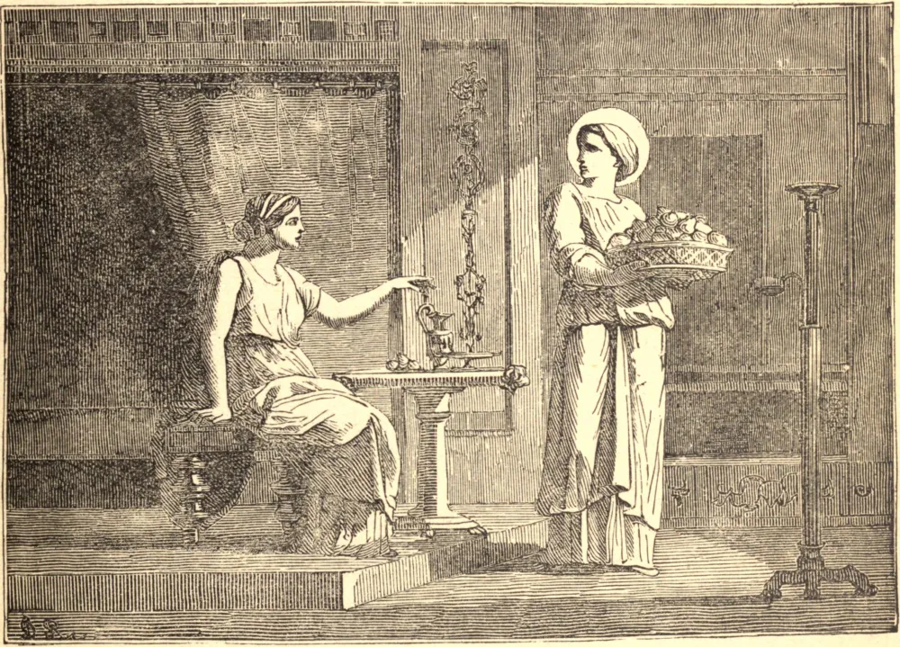

# 3 de setembro — SANTA SERÁFIA, Virgem e Mártir

SANTA SERÁFIA nasceu em Antioquia, de pais cristãos, que, fugindo das perseguições de Adriano, foram para a Itália e ali se estabeleceram. Falecendo seus pais, Seráfia foi pedida em casamento por muitos, mas, havendo resolvido consagrar-se somente a Deus, vendeu todas as suas posses e distribuiu o produto aos pobres; por fim vendeu-se a si mesma a uma escravidão voluntária, e entrou ao serviço de uma dama romana chamada Sabina. A piedade de Seráfia, seu amor ao trabalho e sua caridade logo conquistaram o coração de sua senhora, que não tardou em fazer-se cristã.

Havendo sido denunciada como seguidora de Cristo, Seráfia foi condenada à morte. Foi primeiro colocada sobre uma pira ardente, mas permaneceu ilesa das chamas. Quase desesperando de poder infligir-lhe a morte, o prefeito Berilo ordenou que fosse decapitada, e assim ela recebeu a coroa que tão ricamente merecia.

Sua senhora recolheu os seus restos, e os sepultou com todos os sinais de respeito. Sabina, vindo a sofrer a morte de mártir um ano depois, foi posta no mesmo túmulo com sua fiel serva. Já no século quinto havia em Roma uma igreja colocada sob a sua invocação.

**Reflexão**—A coragem cristã guarda relação com a nossa fé. "Se permanecermos na fé, fundamentados, firmes e inabaláveis", todas as coisas nos serão possíveis.
