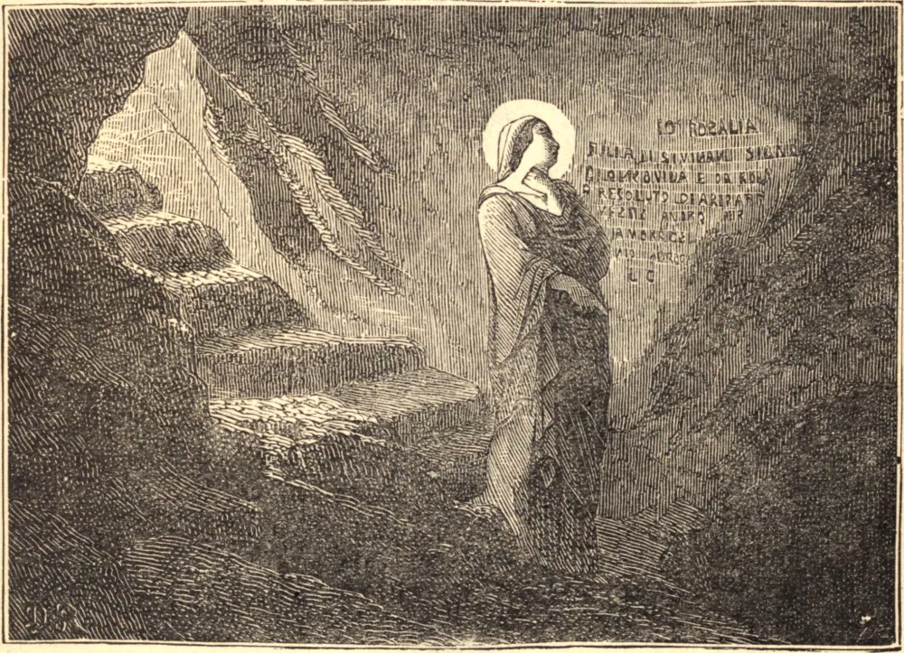

# 4 de setembro — SANTA ROSÁLIA, Virgem

SANTA ROSÁLIA era filha de uma nobre família descendente de Carlos Magno. Nasceu em Palermo, na Sicília, e, desprezando em sua juventude as vaidades mundanas, fez para si uma morada numa caverna no Monte Pelegrino, a três milhas de Palermo, onde consumou o sacrifício de seu coração a Deus por austera penitência e trabalho manual, santificado por assídua oração e pela constante união de sua alma com Deus. Morreu em 1160. Seu corpo foi encontrado sepultado numa gruta sob a montanha, no ano do jubileu de 1625, sob o Papa Urbano VIII, e foi transladado para a igreja metropolitana de Palermo, da qual foi escolhida padroeira. A seu patrocínio aquela ilha atribui a cessação de uma grave pestilência ocorrida nesse mesmo tempo.

SANTA ROSA DE VITERBO, que é honrada neste mesmo dia, nasceu na primavera de 1240, tempo em que Frederico II oprimia a Igreja e muitos eram infiéis à Santa Sé. A menina logo pareceu cheia de graça; com passos vacilantes buscava Jesus em seu tabernáculo, ajoelhava-se diante das imagens sagradas, escutava as conversas piedosas, retendo tudo o que ouvia, e isto quando ela mal tinha três anos de idade. Um hábito grosseiro cobria-lhe a carne; jejuns e disciplinas eram seu deleite. Defender os direitos da Igreja era seu ardente desejo, e para isto recebeu sua missão da Mãe de Deus, que lhe deu o hábito franciscano, com a ordem de sair e pregar. Quando mal tinha dez anos de idade, Rosa desceu à praça pública de Viterbo, conclamou os habitantes a serem fiéis ao Soberano Pontífice, e veementemente denunciou todos os seus opositores. Tão grande foi o poder de sua palavra, e dos milagres que a acompanhavam, que o partido Imperial, em temor e ira, expulsou-a da cidade, mas ela continuou a pregar até que Inocêncio IV foi reconduzido em triunfo a Roma e a causa de Deus foi ganha. Então ela retirou-se para uma pequena cela em Viterbo, e preparou-se na solidão para o seu fim. Morreu no seu décimo oitavo ano. Não muito depois, apareceu em glória a Alexandre IV, e ordenou-lhe que transladasse o seu corpo. Ele o encontrou tal como a visão havia dito, mas fragrante e belo, como se ainda estivesse com vida.

**Reflexão**—Rosa viveu apenas dezessete anos, salvou a causa da Igreja, e morreu Santa. Nós temos vivido, talvez, muito mais tempo, e contudo com que resultado? A cada minuto algo pode ser feito por Deus. Levantemo-nos e ponhamo-nos a fazer.
