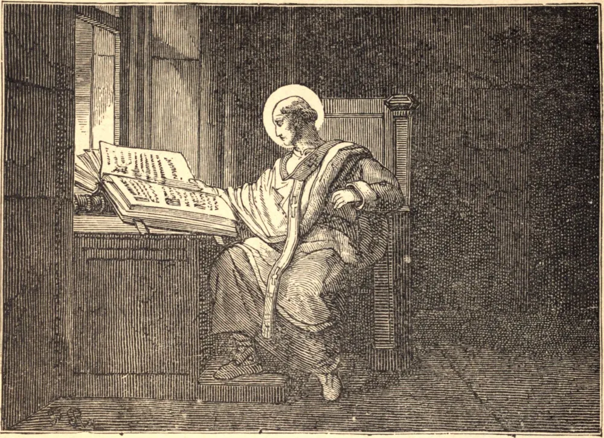

# 5 de setembro — SÃO LOURENÇO JUSTINIANO

LOURENÇO desde criança ansiava por ser Santo; e quando tinha dezenove anos de idade foi-lhe concedida uma visão da eterna Sabedoria. Todas as coisas terrenas empalideceram a seus olhos diante da inefável beleza desta visão, e, à medida que ela se desvanecia, ficou em seu coração um vazio que ninguém senão Deus poderia preencher. Recusando a oferta de um brilhante casamento, fugiu secretamente de seu lar em Veneza, e ingressou nos Cônegos Regulares de São Jorge. Um a um, esmagou todo instinto natural que pudesse obstar a sua união com o seu Amor.

Quando Lourenço entrou primeiramente na vida religiosa, um nobre foi dissuadi-lo da loucura de assim sacrificar toda perspectiva terrena. O jovem monge ouviu pacientemente, por sua vez, o apelo afetuoso de seu amigo, seu escárnio e seu violento ultraje. Calma e bondosamente respondeu então. Apontou-lhe a brevidade da vida, a incerteza da felicidade terrena, e a incomparável superioridade do prêmio que buscava sobre qualquer outro que seu amigo houvesse nomeado. O nobre não pôde dar resposta; sentiu em verdade que Lourenço era sábio, e ele próprio o tolo. Deixou o mundo, tornou-se companheiro de noviciado do Santo, e sua santa morte trouxe todas as marcas de que ele também havia assegurado os tesouros que nunca faltam.

Como superior e como geral, Lourenço ampliou e fortaleceu sua Ordem, e como bispo de sua diocese, a despeito da calúnia e do insulto, reformou inteiramente a sua sé. Seu zelo levou a que fosse nomeado o primeiro patriarca de Veneza, mas permaneceu sempre, em coração e alma, um humilde sacerdote, sedento da visão do céu.

Por fim a visão eterna começou a despontar. "Estais preparando-me um leito de plumas?", disse ele. "Não assim; meu Senhor foi estendido sobre uma árvore dura e dolorosa." Deitado sobre a palha, exclamou em arrebatamento: "Bom Jesus, eis que venho." Morreu em 1435, com setenta e quatro anos de idade.

**Reflexão**—Pedi a São Lourenço que se digne conceder-vos tal senso da suficiência de Deus que também vós voeis a Ele e nele encontreis repouso.
