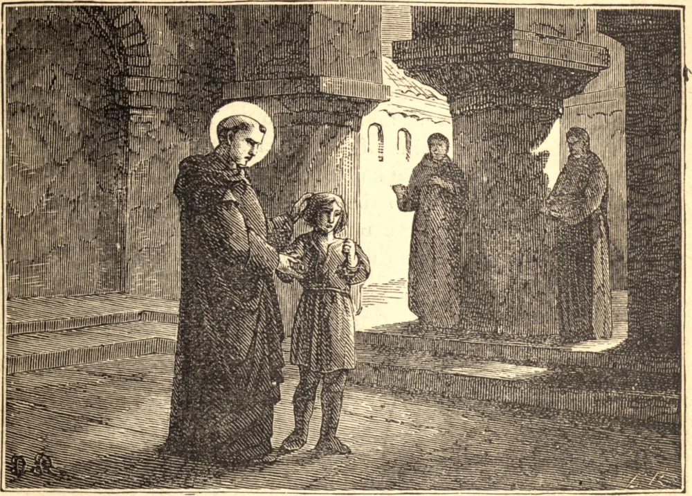

# 6 de setembro — SANTO ELEUTÉRIO, Abade

MARAVILHOSA simplicidade e espírito de compunção eram as virtudes que distinguiam este santo homem. Foi escolhido abade de São Marcos, perto de Espoleto, e favorecido por Deus com o dom dos milagres. Tendo sido libertado, por ser educado em seu mosteiro, um menino que era possesso do demônio, o abade disse certo dia: "Visto que o menino está entre os servos de Deus, o demônio não ousa aproximar-se dele." Estas palavras pareceram saber a vaidade, e por isso o demônio entrou de novo e atormentou o menino. O abade humildemente confessou sua falta, e jejuou e orou com toda a sua comunidade até que o menino foi novamente libertado da tirania do inimigo. São Gregório Magno, não podendo jejuar na véspera da Páscoa por causa de extrema debilidade, conseguiu que este Santo fosse com ele à igreja de Santo André e elevasse suas orações a Deus por sua saúde, para que pudesse unir-se aos fiéis naquela solene prática de penitência. Eleutério orou com muitas lágrimas, e o Papa, ao sair da igreja, achou seu peito subitamente fortalecido, de modo que ficou habilitado a cumprir o jejum como desejava. Santo Eleutério ressuscitou um morto. Renunciando à sua abadia, morreu no mosteiro de Santo André, em Roma, por volta do ano 585.

## Reflexão

"Não pareças aos homens que jejuas, mas a teu Pai que está no céu, e teu Pai, que vê em segredo, te recompensará."
