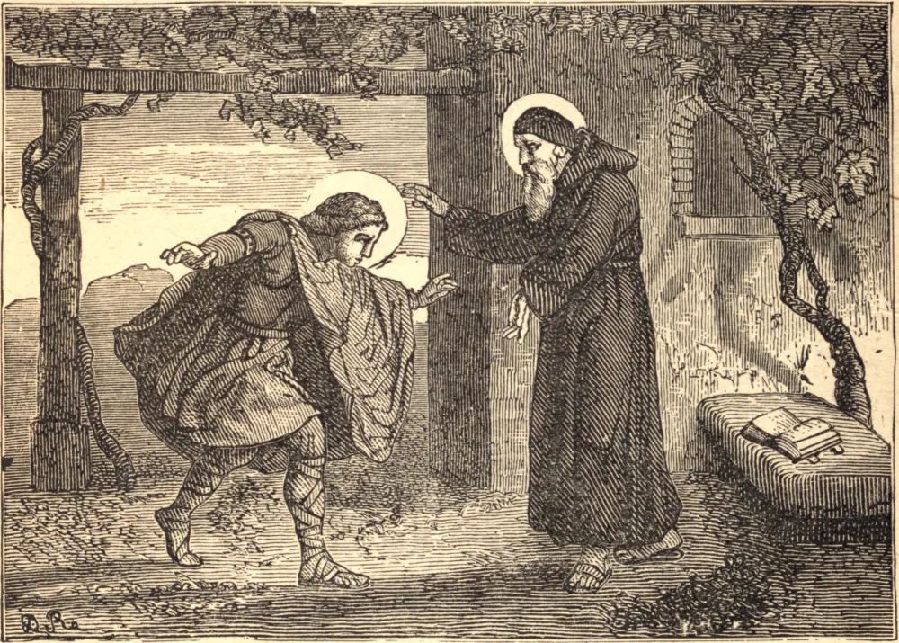

# 7 de setembro — SÃO CLODOALDO, Confessor

SÃO CLODOALDO é o primeiro e mais ilustre Santo entre os príncipes da família real da primeira raça na França. Era filho de Clodomiro, Rei de Orleans, o filho mais velho de Santa Clotilde, e nasceu em 522. Tinha apenas três anos de idade quando seu pai foi morto na Borgonha; mas sua avó Clotilde criou-o, juntamente com seus dois irmãos, em Paris, e amava-os extremamente. Seus ambiciosos tios dividiram entre si o reino de Orleans, e apunhalaram com as próprias mãos dois de seus sobrinhos. Clodoaldo, por uma providência especial, foi salvo do massacre, e, renunciando ao mundo, dedicou-se ao serviço de Deus no estado monástico. Após algum tempo, colocou-se sob a disciplina de São Severino, um santo recluso que vivia perto de Paris, de cujas mãos recebeu o hábito monástico. Desejando viver desconhecido do mundo, retirou-se secretamente para a Provença, mas, tornando-se pública a sua ermida, regressou a Paris, e foi recebido com a maior alegria que se possa imaginar. A pedido instante do povo, foi ordenado sacerdote por Eusébio, Bispo de Paris, em 551, e serviu aquela Igreja por algum tempo nas funções do sagrado ministério. Depois retirou-se para São Clodoaldo, duas léguas abaixo de Paris, onde edificou um mosteiro. Ali reuniu muitos homens piedosos, que fugiam do mundo por temor de nele perderem suas almas. São Clodoaldo era por eles considerado seu superior, e animava-os a toda virtude tanto pela palavra quanto pelo exemplo. Era incansável em instruir e exortar o povo das terras vizinhas, e terminou piedosamente seus dias por volta do ano 560.

## Reflexão

Lembremo-nos de que "os justos viverão para sempre; receberão um reino de glória e uma coroa de beleza da mão do Senhor."
