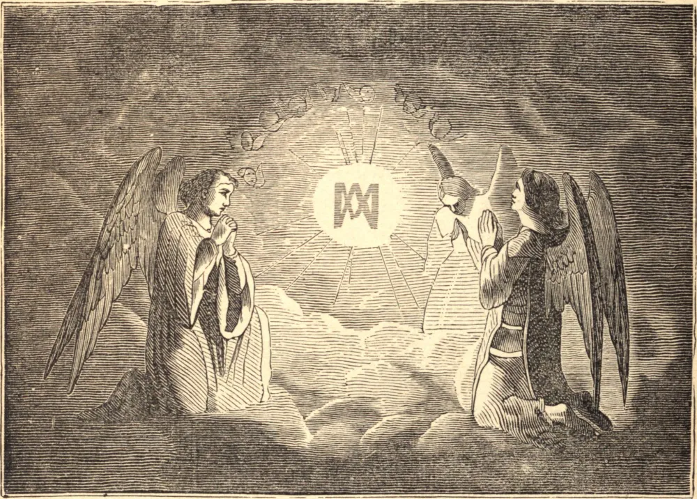

# A FESTA, NO DOMINGO DENTRO DA OITAVA DE SUA NATIVIDADE, DO SANTÍSSIMO NOME DE MARIA

Esta festa foi instituída pelo Papa Inocêncio XI, para que nela os fiéis sejam convocados de modo particular a recomendar a Deus, pela intercessão da Santíssima Virgem, as necessidades de sua Igreja, e a render-Lhe graças por sua graciosa proteção e inumeráveis misericórdias. O que deu ocasião à instituição desta festa foi uma solene ação de graças pelo socorro de Viena, quando foi sitiada pelos turcos em 1683. Se desejamos aplacar a ira divina, justamente provocada por nossos pecados, com nossas orações, devemos unir as lágrimas de sincera compunção a uma perfeita conversão de nossos costumes. A primeira graça que devemos sempre pedir a Deus é que Ele nos leve à disposição de uma penitência condigna. Somente assim nossas súplicas pelas divinas misericórdias, e nossas ações de graças pelos benefícios recebidos, se tornarão aceitáveis. Por nenhum outro meio podemos merecer a bênção de Deus, ou ser a ela recomendados pelo patrocínio de sua santa mãe. À invocação de Jesus é uma prática piedosa e salutar unir a nossa súplica à Santíssima Virgem, para que, por sua intercessão, possamos mais fácil e abundantemente obter os efeitos de nossas petições. Neste sentido, as almas devotas pronunciam, com grande afeto e confiança, os santos nomes de Jesus e Maria.
