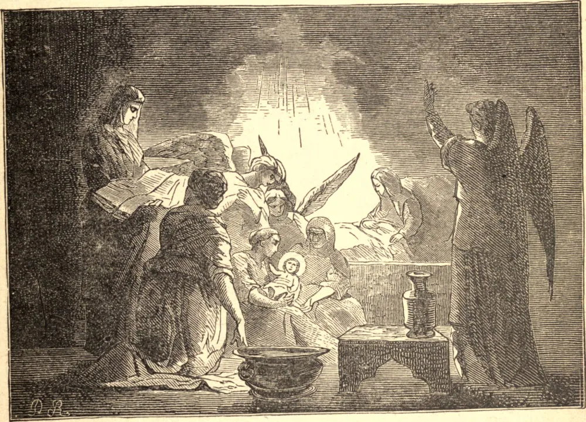

# 8 de setembro — A NATIVIDADE DA SANTÍSSIMA VIRGEM

O nascimento da Santíssima Virgem Maria anunciou alegria e a iminente aproximação da salvação ao mundo perdido. Maria foi trazida ao mundo não como os demais filhos de Adão, infectada com o repugnante contágio do pecado, mas pura, santa, formosa e gloriosa, adornada com todas as mais preciosas graças que convinham àquela que foi escolhida para ser a Mãe de Deus. Ela apareceu, na verdade, no estado fraco de nossa mortalidade; mas aos olhos do Céu já transcendia o mais alto serafim em pureza, brilho e nos mais ricos ornamentos da graça. Se celebramos os aniversários dos grandes deste mundo, quanto mais devemos regozijar-nos no da Virgem Maria, apresentando a Deus a melhor homenagem de nossos louvores e ações de graças pelas grandes misericórdias que Ele nela manifestou, e implorando a sua mediação junto a seu Filho em nosso favor! Cristo não rejeitará as súplicas de sua mãe, a quem Ele se dignou obedecer enquanto esteve na terra. O amor, o cuidado e a ternura dela para com Ele, o título e as qualidades que ela ostenta, a caridade e as graças com que está adornada, e a coroa de glória com que é honrada, hão de incliná-Lo a receber prontamente as suas recomendações e petições.
